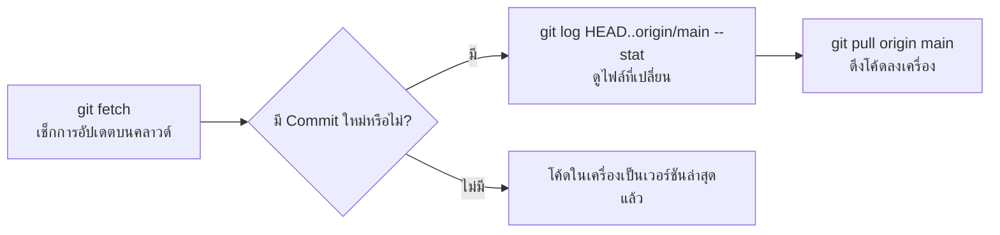

# 📖 คู่มือการใช้งาน Git & GitHub สำหรับโปรเจกต์ IoT Lab Sheet

เอกสารฉบับนี้รวบรวมคำสั่ง Git, เวิร์กโฟลว์ (Workflow) การทำงาน, และแนวทางการจัดการโค้ดใบงานปฏิบัติการ IoT ทั้งหมดในโปรเจกต์

---

## 📑 สารบัญ
1. [คำสั่ง Git พื้นฐานที่ใช้เป็นประจำ](#1-คำสั่ง-git-พื้นฐานที่ใช้เป็นประจำ)
2. [เวิร์กโฟลว์การอัปเดตโค้ด (Update & Sync Workflow)](#2-เวิร์กโฟลว์การอัปเดตโค้ด-update--sync-workflow)
3. [เวิร์กโฟลว์การส่งโค้ดขึ้น GitHub (Commit & Push Workflow)](#3-เวิร์กโฟลว์การส่งโค้ดขึ้น-github-commit--push-workflow)
4. [คำสั่งสำหรับตรวจดูประวัติและความแตกต่าง (History & Diff)](#4-คำสั่งสำหรับตรวจดูประวัติและความแตกต่าง-history--diff)
5. [การจัดการข้อผิดพลาดและคำสั่งกู้คืน (Troubleshooting & Rollback)](#5-การจัดการข้อผิดพลาดและคำสั่งกู้คืน-troubleshooting--rollback)
6. [มาตรฐานโครงสร้างใบงานและฟีเจอร์สำคัญ (Worksheet Features)](#6-มาตรฐานโครงสร้างใบงานและฟีเจอร์สำคัญ-worksheet-features)

---

## 1. คำสั่ง Git พื้นฐานที่ใช้เป็นประจำ

| คำสั่ง | หน้าที่ / การใช้งาน |
| :--- | :--- |
| `git status` | ตรวจสอบสถานะของไฟล์ในเครื่อง (Modified, Untracked, Staged) |
| `git fetch` | ดึงข้อมูล Index ล่าสุดจาก GitHub Remote (`origin`) ลงมาตรวจสอบโดยยังไม่แก้โค้ดในเครื่อง |
| `git pull origin main` | ดึงโค้ดเวอร์ชันล่าสุดจาก GitHub มารวมเข้ากับโค้ดในเครื่อง Local |
| `git add .` | นำไฟล์ที่มีการเปลี่ยนแปลงทั้งหมดเข้าสู่ Staging Area เพื่อเตรียม Commit |
| `git commit -m "ข้อความ"` | บันทึกการเปลี่ยนแปลง (Snapshot) พร้อมระบุข้อความอธิบาย |
| `git push origin main` | ส่ง Commit จากเครื่อง Local ขึ้นไปยัง GitHub Repository |

---

## 2. เวิร์กโฟลว์การอัปเดตโค้ด (Update & Sync Workflow)

เมื่อต้องการตรวจสอบว่าบน GitHub มีการอัปเดตโค้ดใหม่หรือไม่ และดึงลงมาที่เครื่อง:



### ขั้นตอนคำสั่ง:
```bash
# 1. ดึง Index ล่าสุดจาก Remote
git fetch

# 2. ดูว่ามีคอมมิตอะไรใหม่บ้าง และไฟล์ไหนถูกแก้ไข
git log HEAD..origin/main --stat

# 3. ดึงโค้ดลงมายังเครื่อง Local
git pull origin main
```

---

## 3. เวิร์กโฟลว์การส่งโค้ดขึ้น GitHub (Commit & Push Workflow)

เมื่อแก้ไขหรือพัฒนาใบงานเสร็จเรียบร้อยและต้องการนำขึ้น GitHub:

### ขั้นตอนคำสั่ง:
```bash
# 1. ตรวจสอบไฟล์ที่มีการแก้ไข
git status

# 2. เพิ่มไฟล์ทั้งหมดเข้า Staging Area
git add .

# 3. บันทึก Commit พร้อมข้อความมาตรฐาน (Conventional Commits)
# ตัวอย่าง: feat:, fix:, docs:, refactor:
git commit -m "fix: แก้ไขระบบตรวจคะแนนและเพิ่มปุ่มปลดล็อกเริ่มทำใบงานสำหรับ นศ. คนใหม่"

# 4. ส่งโค้ดขึ้น GitHub
git push origin main
```

---

## 4. คำสั่งสำหรับตรวจดูประวัติและความแตกต่าง (History & Diff)

```bash
# ตรวจสอบการแก้ไขโค้ดที่ยังไม่ได้ commit
git diff

# ตรวจสอบการแก้ไขเฉพาะไฟล์
git diff lab1/index.html

# ดูประวัติ Commit ย้อนหลังแบบกระชับ (1 บรรทัดต่อ 1 คอมมิต)
git log --oneline -n 10

# ดูประวัติ Commit แบบกราฟแสดงความเชื่อมโยงของ Branch
git log --oneline --graph --decorate
```

---

## 5. การจัดการข้อผิดพลาดและคำสั่งกู้คืน (Troubleshooting & Rollback)

### 5.1 ต้องการยกเลิกการแก้ไขไฟล์ในเครื่อง (Discard Changes)
```bash
# ยกเลิกการแก้ไขทุกไฟล์และย้อนกลับไปสถานะล่าสุดของ Commit
git restore .

# ยกเลิกการแก้ไขเฉพาะไฟล์ที่ระบุ
git restore lab1/index.html
```

### 5.2 ต้องการพักงานที่ทำค้างไว้ชั่วคราว (Stash)
```bash
# เก็บโค้ดที่แก้ไขไว้ใน Stash ชั่วคราว (ทำให้ working tree สะอาด)
git stash

# ดึงงานที่พักไว้กลับมาทำต่อ
git stash pop
```

### 5.3 กรณีเกิดความขัดแย้ง (Merge Conflict)
1. เมื่อรัน `git pull` แล้วมีข้อความ Conflict ให้เปิดไฟล์ที่มีปัญหา
2. แก้ไขส่วน `<<<<<<< HEAD`, `=======`, `>>>>>>>` ให้เหลือเฉพาะโค้ดที่ถูกต้อง
3. สั่ง `git add <ชื่อไฟล์>` และ `git commit -m "merge: resolve conflict"`

---

## 6. มาตรฐานโครงสร้างใบงานและฟีเจอร์สำคัญ (Worksheet Features)

ใบงานปฏิบัติการ IoT ทั้งหมดในโปรเจกต์ (18 ใบงาน) มีมาตรฐานทางเทคนิคดังนี้:

1. **ระบบประเมินคะแนน Regex Evaluation Engine**:
   - ตรวจสอบช่องว่างโค้ด (`evaluateLabXBlanks()`) คิดคะแนน 1.5 คะแนน
   - ตรวจสอบโค้ดโจทย์ท้าทาย (`evaluateLabXChallenge()`) คิดคะแนน 2.5 คะแนน
2. **แบบทดสอบปรนัย (5-Question Multiple Choice Quiz)**:
   - ตรวจสอบคำตอบ 5 ข้อ (ข้อละ 0.4 คะแนน = รวม 2.0 คะแนน)
3. **คำถามท้ายการทดลอง 3 ข้อ**:
   - ข้อละประมาณ 0.83 - 0.85 คะแนน = รวม 2.5 คะแนน
4. **ระบบตรวจไฟล์แนบ Multi-layer Attachments**:
   - ภาพผลการทดลอง (0.5 คะแนน) + ไฟล์ซอร์สโค้ด (0.5 คะแนน) = รวม 1.0 คะแนน
5. **ข้อกำหนดการสรุปผลการทดลอง**:
   - ต้องพิมพ์วิเคราะห์สรุปผล **มากกว่า 100 ตัวอักษร** (0.5 คะแนน)
6. **ระบบปลดล็อกสำหรับ นศ. คนใหม่ (`New Student Reset`)**:
   - ฟังก์ชัน `confirmResetForNewStudent()` และ `unlockFormForNewStudent()`
   - มีปุ่มปลดล็อกที่แถบด้านบน (`submittedNoticeBanner`) และด้านล่าง (`#newStudentBtn`)
   - ล้างข้อมูลฟอร์ม, ค่า Cache, และปลดล็อกช่องกรอกข้อมูลทั้งหมดเพื่อให้ผู้เรียนคนถัดไปใช้งานต่อได้ทันที
