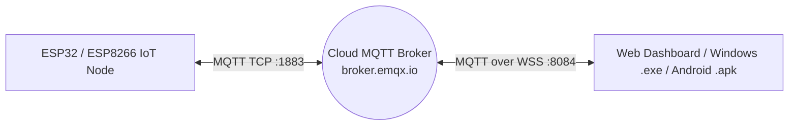

# คู่มือการเรียนรู้ Lab 5: Cloud MQTT & Cross-Platform Dashboard (Windows & Android)

คู่มือนี้อธิบายขั้นตอนการพัฒนาระบบ IoT โดยปรับเปลี่ยนสถาปัตยกรรมการสื่อสารจาก **Local WebSockets (Lab 4)** สู่ **Cloud MQTT Broker (Lab 5)** เพื่อให้สามารถรับส่งข้อมูลและควบคุมข้ามเครือข่ายอินเทอร์เน็ตได้จากทุกที่ทั่วโลก พร้อมการออกแบบแดชบอร์ดที่ใช้งานร่วมกันได้อย่างต่อเนื่อง และการแพ็กเกจเป็นแอปเดสก์ท็อปบน Windows (`.exe`) และแอปมือถือบน Android (`.apk`)

---

## สารบัญ
1. [ภาพรวมสถาปัตยกรรมและโครงสร้างข้อมูล (Architecture & JSON Schema)](#1-ภาพรวมสถาปัตยกรรมและโครงสร้างข้อมูล)
2. [การกำหนดขาพินฮาร์ดแวร์ (Hardware Pinouts)](#2-การกำหนดขาพินฮาร์ดแวร์)
3. [ขั้นตอนที่ 1: การเขียนโปรแกรมฝั่งบอร์ด (C++ / PlatformIO)](#ขั้นตอนที่-1-การเขียนโปรแกรมฝั่งบอร์ด)
4. [ขั้นตอนที่ 2: การพัฒนาแดชบอร์ดเว็บแบบเรียลไทม์ (MQTT.js)](#ขั้นตอนที่-2-การพัฒนาแดชบอร์ดเว็บแบบเรียลไทม์)
5. [ขั้นตอนที่ 3: การสร้างแอปพลิเคชันเดสก์ท็อป Windows (.exe)](#ขั้นตอนที่-3-การสร้างแอปพลิเคชันเดสก์ท็อป-windows)
6. [ขั้นตอนที่ 4: การสร้างแอปพลิเคชันมือถือ Android (.apk)](#ขั้นตอนที่-4-การสร้างแอปพลิเคชันมือถือ-android)

---

## 1. ภาพรวมสถาปัตยกรรมและโครงสร้างข้อมูล

อุปกรณ์ IoT Node เชื่อมต่อเข้ากับ **Cloud MQTT Broker** (`broker.emqx.io`) ผ่านพอร์ต 1883 ในขณะที่แดชบอร์ดเบราว์เซอร์หรือแอปพลิเคชันเชื่อมต่อผ่าน WebSockets Secure (WSS) พอร์ต 8084



### การจัดสรรหัวข้อการสื่อสาร (MQTT Topics)
* **บอร์ดรายงานสถานะ (Publish):** หัวข้อ `esp-node/state` ทุก 3 วินาที หรือเมื่อสถานะเปลี่ยนแปลง
  ```json
  {
    "temp": 28.5,
    "humidity": 65.0,
    "soil": 42.8,
    "fan": false,
    "mist": false,
    "threshold": 30.0,
    "hum_threshold": 50.0,
    "press": 3,
    "mode": true,
    "mist_mode": true
  }
  ```
* **รับคำสั่งควบคุมจากแดชบอร์ด (Subscribe):** หัวข้อ `esp-node/control/cmd`
  * เปิด-ปิดพัดลม: `{"action": "toggle_fan", "value": true}`
  * เปิด-ปิดปั๊มหมอก: `{"action": "toggle_mist", "value": true}`
  * สลับโหมดพัดลมอัตโนมัติ: `{"action": "toggle_mode", "value": true}`
  * สลับโหมดปั๊มพ่นหมอกอัตโนมัติ: `{"action": "toggle_mist_mode", "value": true}`
  * ปรับเกณฑ์อุณหภูมิพัดลม: `{"threshold": 31.5}` หรือ `{"action": "set_threshold", "value": 31.5}`
  * ปรับเกณฑ์ความชื้นปั๊มหมอก: `{"hum_threshold": 55.0}` หรือ `{"action": "set_hum_threshold", "value": 55.0}`

---

## 2. การกำหนดขาพินฮาร์ดแวร์

| อุปกรณ์ / ฟังก์ชัน | บอร์ด IPST-WiFi (ESP32) | บอร์ด AX-WiFi (ESP8266) | หมายเหตุ |
|---|---|---|---|
| **DHT11 Sensor** | GPIO 33 | GPIO 2 (D4) หรือ GPIO 0 (D3) | วัดอุณหภูมิและความชื้น |
| **Analog KNOB / VR** | GPIO 36 (KNOB-S) | A0 (VR) | แอนะล็อกแปลงเป็น 0 - 100% |
| **Fan Relay** | GPIO 5 | GPIO 13 (D7) | ควบคุมพัดลมจำลอง |
| **Mist Relay** | GPIO 23 | GPIO 16 (D0) | ควบคุมปั๊มพ่นหมอกจำลอง |
| **ปุ่มกดสวิตช์** | GPIO 0 (SW1) | GPIO 0 (FLASH) | สลับสถานะพัดลมและนับจำนวนกด |
| **จอ OLED SSD1306** | I2C (SDA: 21, SCL: 22) | I2C (SDA: 4, SCL: 5) | แสดง IP, MQTT Status, และเซ็นเซอร์ |

---

## 3. ขั้นตอนที่ 1: การเขียนโปรแกรมฝั่งบอร์ด

### 3.1 ตั้งค่าไลบรารีใน `platformio.ini`
```ini
[platformio]
default_envs = ipst_wifi

[env:ipst_wifi]
platform = espressif32
board = esp32dev
framework = arduino
monitor_speed = 115200
lib_deps =
    adafruit/DHT sensor library @ ^1.4.6
    adafruit/Adafruit Unified Sensor @ ^1.1.14
    knolleary/PubSubClient @ ^2.8
    bblanchon/ArduinoJson @ ^7.0.4
    adafruit/Adafruit GFX Library @ ^1.11.9
    adafruit/Adafruit SSD1306 @ ^2.5.9
```

### 3.2 ซอร์สโค้ดโปรแกรม (`src/main.cpp`)
โค้ดโปรแกรมฉบับสมบูรณ์จัดเก็บไว้ใน `LAB5_Dev/solution/src/main.cpp` โดยมีฟังก์ชันสำคัญ:
* `reconnectMqtt()`: จัดการเชื่อมต่อ Broker อัตโนมัติแบบ Non-blocking
* `mqttCallback()`: แปลง JSON คำสั่งเพื่อสั่งงานขา GPIO และปรับตัวแปร `tempThreshold`
* `publishSensorState()`: สรุปค่าเซ็นเซอร์และสถานะทั้งหมดส่งขึ้น Cloud
* **Hysteresis Logic:** ทำงานในโหมด `autoMode` โดยเทียบค่าอุณหภูมิกับ `tempThreshold` (ต่างระดับ 0.5°C ป้องกันการติด-ดับถี่)

---

## 4. ขั้นตอนที่ 2: การพัฒนาแดชบอร์ดเว็บแบบเรียลไทม์

ไฟล์แดชบอร์ดสำหรับใช้งานกับบอร์ดหรือเปิดบนเบราว์เซอร์จัดเก็บอยู่ใน `LAB5_Dev/solution/data/index.html` และ `styles.css`
* เชื่อมต่อ Broker ผ่านไลบรารี `MQTT.js` ที่พอร์ต WSS 8084
* มีแผงควบคุมสไลเดอร์ปรับค่า Threshold ส่งไปยังบอร์ด
* มีโมดอลปรับเปลี่ยน URL Broker และ Topics เพื่อแยกกลุ่มการทดลองได้อย่างอิสระ

---

## 5. ขั้นตอนที่ 3: การสร้างแอปพลิเคชันเดสก์ท็อป Windows (.exe)

คุณสามารถแปลงแดชบอร์ด HTML/JS ให้เป็นไฟล์ติดตั้ง Windows ได้ง่ายดายด้วย **Electron** หรือ **NW.js**:

1. ติดตั้ง Node.js บนเครื่องคอมพิวเตอร์
2. สร้างโฟลเดอร์สำหรับแอปเดสก์ท็อป เช่น `LAB5_Dev/desktop-app/` และคัดลอกไฟล์จาก `solution/data/` ลงไป
3. สร้างไฟล์ `package.json`:
   ```json
   {
     "name": "iot-mqtt-dashboard",
     "version": "1.0.0",
     "main": "main.js",
     "scripts": {
       "start": "electron .",
       "dist": "electron-builder"
     }
   }
   ```
4. สร้างไฟล์ `main.js`:
   ```javascript
   const { app, BrowserWindow } = require('electron');
   const path = require('path');

   function createWindow() {
     const win = new BrowserWindow({
       width: 1024,
       height: 768,
       icon: path.join(__dirname, 'icon.png'),
       webPreferences: { nodeIntegration: true }
     });
     win.loadFile('index.html');
   }

   app.whenReady().then(createWindow);
   ```
5. รันคำสั่งแพ็กเกจ:
   ```bash
   npm install electron electron-builder --save-dev
   npx electron-builder --win
   ```
   ไฟล์ `.exe` จะถูกสร้างในโฟลเดอร์ `dist/`

---

## 6. ขั้นตอนที่ 4: การสร้างแอปพลิเคชันมือถือ Android (.apk)

สามารถแปลงแดชบอร์ดเป็น Android App (.apk) ด้วย **Capacitor**:

1. ติดตั้ง `@capacitor/cli` และ `@capacitor/android`:
   ```bash
   npm install @capacitor/core @capacitor/cli @capacitor/android
   npx cap init "MQTT Dashboard" com.iotlab.mqttdash --web-dir solution/data
   npx cap add android
   npx cap copy
   ```
2. เปิด Android Studio แล้วสั่ง Build APK:
   ```bash
   npx cap open android
   ```
   ใน Android Studio เลือกเมนู **Build > Build Bundle(s) / APK(s) > Build APK(s)**
