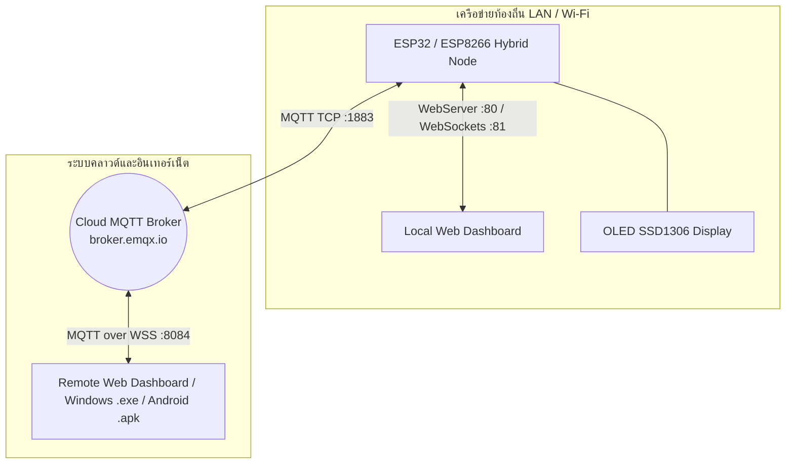
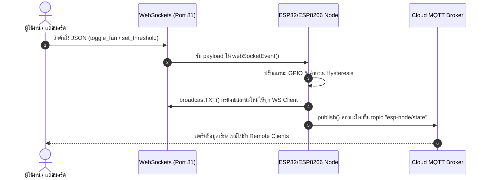

# คู่มือการเรียนรู้ Lab 6: การประยุกต์ใช้การสื่อสารแบบผสมผสาน (Hybrid Dual-Protocol: WebSockets & Cloud MQTT)

คู่มือนี้อธิบายขั้นตอนการพัฒนาระบบ IoT โดยประยุกต์และรวมสถาปัตยกรรมการสื่อสารสองรูปแบบหลัก ได้แก่ **Local WebSockets (Lab 4)** สำหรับการเชื่อมต่อตรงความหน่วงต่ำภายในเครือข่ายท้องถิ่น (LAN) และ **Cloud MQTT Broker (Lab 5)** สำหรับการสื่อสารระยะไกลข้ามอินเทอร์เน็ตเข้าด้วยกันในโหนดเดียว (Hybrid Mode) พร้อมหน้าจอแสดงผล OLED SSD1306 แดชบอร์ดสลับโหมดเรียลไทม์ และระบบตรวจคะแนนใบงานอัตโนมัติ

---

## วัตถุประสงค์การเรียนรู้ (Learning Objectives)
1. **เข้าใจสถาปัตยกรรมการสื่อสารแบบผสมผสาน (Hybrid Dual-Protocol Architecture)**: สามารถอธิบายหลักการทำงานร่วมกันระหว่าง Local WebSockets (Port 81) และ Cloud MQTT Broker (`broker.emqx.io`:1883) ในอุปกรณ์ IoT โหนดเดียวกันได้
2. **พัฒนาโปรแกรมสื่อสารสองทางคู่ขนานบน ESP32/ESP8266**: สามารถเขียนโปรแกรมภาษา C++ (Arduino/PlatformIO) จัดการ `WebSocketsServer` และ `PubSubClient` ร่วมกับการแสดงผลจอ OLED SSD1306 และอ่านค่าเซ็นเซอร์แบบ Non-blocking
3. **ออกแบบระบบซิงโครไนซ์ข้อมูลสองทิศทาง (Bidirectional State Synchronization)**: สามารถรับส่งโครงสร้างข้อมูล JSON และกระจายสถานะ (Broadcast & Publish) ไปยังช่องทาง Local WebSockets และ Cloud MQTT พร้อมกันเมื่อสถานะอุปกรณ์เปลี่ยนแปลง
4. **พัฒนาหน้าแดชบอร์ดเว็บสลับโหมดการเชื่อมต่อ (Multi-Protocol Web Dashboard)**: สามารถพัฒนา Web Interface (JavaScript/MQTT.js) ที่เลือกเชื่อมต่อผ่าน Local WS และ Cloud MQTT พร้อมแสดงสถานะการเชื่อมต่อแบบเรียลไทม์
5. **วิเคราะห์เปรียบเทียบความหน่วงและความเสถียร (Latency & Redundancy Analysis)**: สามารถเปรียบเทียบข้อดี-ข้อเสียระหว่าง WebSockets และ MQTT พร้อมประยุกต์ใช้เป็นระบบสำรอง (Fallback) ในงานอุตสาหกรรมและสมาร์ทโฮม

---

## สารบัญ
1. [วัตถุประสงค์การเรียนรู้ (Learning Objectives)](#วัตถุประสงค์การเรียนรู้-learning-objectives)
2. [ภาพรวมสถาปัตยกรรมและโครงสร้างข้อมูล (Hybrid Architecture & JSON Schema)](#1-ภาพรวมสถาปัตยกรรมและโครงสร้างข้อมูล)
3. [การกำหนดขาพินฮาร์ดแวร์ (Hardware Pinouts)](#2-การกำหนดขาพินฮาร์ดแวร์)
4. [ขั้นตอนที่ 1: การเขียนโปรแกรมฝั่งบอร์ด (C++ / PlatformIO)](#ขั้นตอนที่-1-การเขียนโปรแกรมฝั่งบอร์ด)
5. [ขั้นตอนที่ 2: การพัฒนาแดชบอร์ดเว็บแบบ Dual-Protocol](#ขั้นตอนที่-2-การพัฒนาแดชบอร์ดเว็บแบบ-dual-protocol)
6. [ขั้นตอนที่ 3: การแพ็กเกจเป็นแอปพลิเคชัน Windows (.exe) และ Android (.apk)](#ขั้นตอนที่-3-การแพ็กเกจเป็นแอปพลิเคชัน)
7. [แนวทางการตรวจใบงานและการทำโจทย์ท้าทาย](#6-แนวทางการตรวจใบงานและการทำโจทย์ท้าทาย)

---

## 1. ภาพรวมสถาปัตยกรรมและโครงสร้างข้อมูล

ใน Lab 6 อุปกรณ์ IoT Node จะทำงานเป็น **Hybrid Server & Client** ในเวลาเดียวกัน:
* **Local WebSockets Server (Port 81):** ให้บริการการเชื่อมต่อโดยตรงกับหน้าเว็บเบราว์เซอร์หรือแอปพลิเคชันในเครือข่าย Wi-Fi เดียวกันโดยไม่ต้องใช้อินเทอร์เน็ต
* **Cloud MQTT Client (Port 1883):** เชื่อมต่อไปยัง Cloud MQTT Broker (`broker.emqx.io`) เพื่อรายงานสถานะและรับคำสั่งจากภายนอกผ่านอินเทอร์เน็ต



### ลำดับการซิงค์ข้อมูลแบบสองทาง (Sequence Diagram)
เมื่อเกิดการเปลี่ยนแปลงสถานะ (เช่น ปุ่มกดภายนอก, การเปลี่ยนค่าเซ็นเซอร์ หรือคำสั่งจากหน้าเว็บ) บอร์ดจะกระจายข้อมูลออกไปยังทั้งสองช่องทางพร้อมกัน:



### โครงสร้างข้อมูล JSON สื่อสาร (JSON Schema)
* **โครงสร้างการรายงานสถานะ (Publish & Broadcast):**
  ```json
  {
    "temp": 28.5,
    "humidity": 65.0,
    "soil": 42.8,
    "fan": false,
    "mist": false,
    "threshold": 30.0,
    "press": 3,
    "mode": true,
    "ws_clients": 2,
    "mqtt_conn": true
  }
  ```

* **โครงสร้างคำสั่งควบคุม (Incoming Commands):**
  * สลับพัดลม: `{"action": "toggle_fan", "value": true}`
  * สลับปั๊มหมอก: `{"action": "toggle_mist", "value": true}`
  * สลับโหมดออโต้: `{"action": "toggle_mode", "value": true}`
  * ตั้งค่าเกณฑ์อุณหภูมิ: `{"action": "set_threshold", "value": 32.0}` หรือ `{"threshold": 32.0}`

---

## 2. การกำหนดขาพินฮาร์ดแวร์

| อุปกรณ์ / ฟังก์ชัน | บอร์ด IPST-WiFi (ESP32) | บอร์ด AX-WiFi (ESP8266) | หมายเหตุ |
|---|---|---|---|
| **DHT11 Sensor** | GPIO 33 | GPIO 2 (D4) หรือ GPIO 0 (D3) | วัดอุณหภูมิและความชื้น |
| **Analog KNOB / VR** | GPIO 36 (KNOB-S) | A0 (VR) | แอนะล็อกแปลงเป็น 0 - 100% |
| **Fan Relay** | GPIO 5 | GPIO 13 (D7) | ควบคุมพัดลมจำลอง |
| **Mist Relay** | GPIO 23 | GPIO 16 (D0) | ควบคุมปั๊มพ่นหมอกจำลอง |
| **ปุ่มกดสวิตช์** | GPIO 0 (SW1) | GPIO 0 (FLASH) | สลับสถานะพัดลมและนับจำนวนกด |
| **จอ OLED SSD1306** | I2C (SDA: 21, SCL: 22) | I2C (SDA: 4, SCL: 5) | แสดง IP, WS Clients, MQTT และเซ็นเซอร์ |

---

## 3. ขั้นตอนที่ 1: การเขียนโปรแกรมฝั่งบอร์ด

### 3.1 คอนฟิกไลบรารีใน `platformio.ini`
เปิดไฟล์ `solution/platformio.ini` และรวมไลบรารีที่จำเป็นดังนี้:
```ini
[platformio]
default_envs = ipst_wifi

[env:ipst_wifi]
platform = espressif32
board = esp32dev
framework = arduino
monitor_speed = 115200
board_build.filesystem = littlefs
lib_deps =
    adafruit/DHT sensor library @ ^1.4.6
    adafruit/Adafruit Unified Sensor @ ^1.1.14
    links2004/WebSockets @ ^2.4.1
    knolleary/PubSubClient @ ^2.8
    bblanchon/ArduinoJson @ ^7.0.4
    adafruit/Adafruit GFX Library @ ^1.11.9
    adafruit/Adafruit SSD1306 @ ^2.5.9
```

### 3.2 ซอร์สโค้ดโปรแกรม (`src/main.cpp`)
โค้ดโปรแกรมฉบับสมบูรณ์จัดเก็บอยู่ใน `LAB6_Dev/solution/src/main.cpp` โดยมีจุดเน้นสำคัญ:
1. **`broadcastAndPublishState()`**: ฟังก์ชันกลางส่งข้อมูลสถานะล่าสุดไปยังท่อ WebSockets (`webSocket.broadcastTXT()`) และ Cloud MQTT (`mqttClient.publish()`) พร้อมกัน
2. **`handleIncomingCommand()`**: ฟังก์ชันวิเคราะห์ JSON คำสั่งจากทั้งสองโปรโตคอลเพื่อปรับเปลี่ยนตัวแปรระบบและสั่งการ GPIO
3. **`loop()`**: เรียกใช้งาน `server.handleClient()`, `webSocket.loop()`, และ `mqttClient.loop()` แบบ Non-blocking ร่วมกับการสุ่มอ่านเซ็นเซอร์ทุก 2 วินาที

---

## 4. ขั้นตอนที่ 2: การพัฒนาแดชบอร์ดเว็บแบบ Dual-Protocol

ไฟล์แดชบอร์ดใน `solution/data/index.html` และ `styles.css` ออกแบบให้สามารถเลือกช่องทางการสื่อสารได้อย่างยืดหยุ่น:
* **Hybrid Dual Mode (Auto):** เชื่อมต่อทั้ง WebSocket และ MQTT พร้อมกัน และใช้ช่องทางที่พร้อมใช้งานที่สุด
* **Local WebSockets:** บังคับสื่อสารผ่าน `ws://<ESP-IP>:81`
* **Cloud MQTT:** บังคับสื่อสารผ่าน `wss://broker.emqx.io:8084/mqtt`

---

## 5. ขั้นตอนที่ 3: การแพ็กเกจเป็นแอปพลิเคชัน

### 5.1 การแพ็กเกจเป็นแอปพลิเคชันเดสก์ท็อป Windows (.exe)
ใช้คำสั่ง `npx nativefier` หรือ `electron-packager` ในการสร้างแอปพลิเคชันเดสก์ท็อป:
```bash
npx nativefier --name "Lab6_Hybrid_Dashboard" "http://192.168.1.100" --single-instance --portable
```

### 5.2 การแพ็กเกจเป็นแอปพลิเคชันมือถือ Android (.apk)
1. อัปโหลดไฟล์แดชบอร์ดขึ้นบริการ WebIntoApp.com
2. กำหนดชื่อแอปพลิเคชันและสร้างไฟล์ติดตั้ง `.apk` สำหรับติดตั้งบนสมาร์ตโฟน Android

---

## 6. แนวทางการตรวจใบงานและการทำโจทย์ท้าทาย

1. **เปิดไฟล์ `LAB6_Dev/index.html` บนเว็บเบราว์เซอร์**
2. **กรอกรหัสนักศึกษา ชื่อ-นามสกุล และกลุ่มเรียน**
3. **เติมคำตอบในช่องว่างของโค้ดโครงร่างโปรโตคอลคู่**
4. **ตอบคำถามเชิงวิเคราะห์เปรียบเทียบระหว่าง WebSocket และ MQTT**
5. **แนบไฟล์หลักฐานภาพถ่ายการทดสอบบอร์ดจริงและกดปุ่ม "ส่งใบงานและประเมินคะแนน"**
