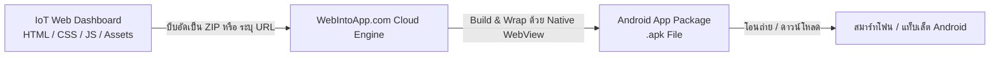

# คู่มือการแปลง Web App เป็น Installable App (.apk) ด้วย WebIntoApp.com

คู่มือนี้จัดทำขึ้นสำหรับการเรียนการสอนและการพัฒนาระบบ IoT โดยอธิบายขั้นตอนการแปลง **Web Dashboard (HTML / CSS / JavaScript)** จาก **Lab 4 (Local WebSockets)** หรือ **Lab 5 (Cloud MQTT)** ให้กลายเป็น **แอปพลิเคชันติดตั้งบนมือถือ Android (.apk)** ได้อย่างสะดวกรวดเร็วผ่านแพลตฟอร์มคลาวด์ **[WebIntoApp.com](https://www.webintoapp.com/)** โดยไม่ต้องติดตั้ง Android Studio หรือคอมไพเลอร์ที่ซับซ้อน

---

## สารบัญ
1. [ภาพรวมของ WebIntoApp.com](#1-ภาพรวมของ-webintoappcom)
2. [รูปแบบการแปลง 2 วิธี (Hosted URL vs Offline HTML Files)](#2-รูปแบบการแปลง-2-วิธี)
3. [การเตรียมความพร้อมและไฟล์ที่ต้องใช้](#3-การเตรียมความพร้อมและไฟล์ที่ต้องใช้)
4. [ขั้นตอนการแปลงแอปอย่างละเอียด (Step-by-Step)](#4-ขั้นตอนการแปลงแอปอย่างละเอียด-step-by-step)
5. [การติดตั้งไฟล์ .apk ลงบนอุปกรณ์ Android](#5-การติดตั้งไฟล์-apk-ลงบนอุปกรณ์-android)
6. [ข้อแนะนำเฉพาะสำหรับ IoT Dashboard (WebSockets & MQTT)](#6-ข้อแนะนำเฉพาะสำหรับ-iot-dashboard)
7. [การแก้ไขปัญหาที่พบบ่อย (Troubleshooting & FAQs)](#7-การแก้ไขปัญหาที่พบบ่อย)

---

## 1. ภาพรวมของ WebIntoApp.com

**WebIntoApp (Web Into App)** เป็นบริการสร้างแอปพลิเคชันบนคลาวด์ (Cloud-based App Builder) ที่ทำหน้าที่นำโค้ดเว็บไซต์หรือไฟล์หน้าเว็บ HTML/JS/CSS มาห่อหุ้ม (Wrap) ให้อยู่ในรูปแบบของ **Native Android WebView Container** ทำให้ได้ไฟล์ติดตั้ง `.apk` (สำหรับติดตั้งโดยตรง) และ `.aab` (สำหรับส่งขึ้น Google Play Store)

### จุดเด่นของ WebIntoApp:
* **ไม่ต้องติดตั้งโปรแกรมบนเครื่อง:** ทำงานผ่านเว็บเบราว์เซอร์ได้ 100%
* **รวดเร็ว:** ใช้เวลาแปลงและคอมไพล์เพียง 1–3 นาที
* **รองรับ 2 รูปแบบ:** ทั้งแบบเชื่อมโยงลิงก์ URL และแบบรวมไฟล์ออฟไลน์ (Offline Embedded Files)
* **ฟรีสำหรับนักเรียน/นักศึกษา:** มีตัวเลือกดาวน์โหลดฟรี (Free Plan) สำหรับการทดลองและติดตั้งใช้งานทั่วไป

---

## 2. รูปแบบการแปลง 2 วิธี

| คุณสมบัติ | วิธีที่ 1: Online Hosted URL | วิธีที่ 2: Offline HTML Files (ZIP) |
|---|---|---|
| **แหล่งที่มา** | เว็บไซต์ที่เผยแพร่ออนไลน์แล้ว เช่น GitHub Pages, Vercel, Firebase หรือ Google Apps Script Web App | ไฟล์ `index.html`, `styles.css`, รูปภาพ ที่บีบอัดเป็น `.zip` |
| **การทำงาน** | แอปจะโหลดหน้าเว็บสดจากเซิร์ฟเวอร์อินเทอร์เน็ต | ไฟล์หน้าเว็บจะถูกฝังอยู่ในตัวแอปโดยตรง |
| **การอัปเดต** | เมื่อแก้หน้าเว็บบนโฮสต์ แอปจะเปลี่ยนตามทันที | ต้องสร้างไฟล์ `.apk` ใหม่เมื่อมีการแก้โค้ดหน้าเว็บ |
| **ความเหมาะสม** | เหมาะกับ Web App ที่มีโฮสติ้ง หรือระบบรายงานผลออนไลน์ | เหมาะกับ IoT Local Dashboard เช่น `LAB5_Dev/solution/data/` |

---

## 3. การเตรียมความพร้อมและไฟล์ที่ต้องใช้

### 3.1 กรณีใช้ไฟล์ออฟไลน์ (Offline ZIP)
หากต้องการนำแดชบอร์ดจากโปรเจกต์แล็บ เช่น `LAB5_Dev/solution/data/` มาแปลงเป็นแอป:
1. ตรวจสอบว่าในโฟลเดอร์มีไฟล์เริ่มต้นชื่อ `index.html` เสมอ
2. ตรวจสอบไฟล์ประกอบ เช่น `styles.css`, รูปภาพ, ไอคอน อยู่ในระดับเดียวกันหรือโฟลเดอร์ย่อยที่อ้างอิงถูกต้อง
3. **การบีบอัดไฟล์ (ZIP):**
   * เลือกไฟล์ทั้งหมดในโฟลเดอร์ (`index.html`, `styles.css` ฯลฯ)
   * คลิกขวา > **Compress to ZIP file** (ตั้งชื่อ เช่น `iot_dashboard.zip`)
   * *ข้อควรระวัง:* ไฟล์ `index.html` ต้องอยู่ที่ Root ของไฟล์ ZIP (ห้ามซ้อนโฟลเดอร์ด้านใน)

### 3.2 การเตรียมรูปไอคอนแอป (App Icon)
* เตรียมไฟล์ภาพไอคอนในรูปแบบ **PNG** ขนาดแนะนำ **512 x 512 พิกเซล** เพื่อความคมชัดบนหน้าจอมือถือ

---

## 4. ขั้นตอนการแปลงแอปอย่างละเอียด (Step-by-Step)

### ขั้นตอนที่ 1: เข้าสู่เว็บไซต์
เปิดเว็บเบราว์เซอร์และไปที่ **[https://www.webintoapp.com/](https://www.webintoapp.com/)**

---

### ขั้นตอนที่ 2: เลือกประเภทข้อมูลต้นทาง (Select Maker Type)
บนหน้าแรกของ WebIntoApp จะมีปุ่มเลือก:
* **Online URL:** ป้อนลิงก์ URL ของคุณ (เช่น `https://allarm2553.github.io/iot-lab/...`)
* **All Files in a Zip Archive:** คลิกเพื่อเลือกอัปโหลดไฟล์ `.zip` ที่เตรียมไว้

จากนั้นกดปุ่ม **"Get Started"**

---

### ขั้นตอนที่ 3: กรอกข้อมูลแอปพลิเคชัน (App Identity)
กำหนดรายละเอียดพื้นฐานของแอป:
1. **App Name:** ชื่อแอปพลิเคชันที่จะแสดงบนหน้าจอมือถือ เช่น `IoT MQTT Dashboard`
2. **Package Name (App ID):** รหัสระบุตัวตนของแอปในรูปแบบย้อนกลับ (Reverse Domain) เช่น `com.iotlab.mqttdashboard`
3. **App Version:** กำหนดเวอร์ชัน เช่น `1.0.0`
4. **App Icon:** คลิกที่กรอบรูปเพื่ออัปโหลดไฟล์รูปภาพไอคอน PNG (512x512)

---

### ขั้นตอนที่ 4: ตั้งค่าฟังก์ชันเพิ่มเติม (App Settings)
ในแถบการตั้งค่า สามารถกำหนดคุณสมบัติพิเศษได้:
* **Screen Orientation:** 
  * `Auto` (หมุนหน้าจออัตโนมัติ)
  * `Portrait` (แนวตั้ง)
  * `Landscape` (แนวนอน - เหมาะกับหน้าจอแดชบอร์ดหลายกราฟ)
* **Pull to Refresh:** เปิด/ปิด ฟังก์ชันลากนิ้วลงเพื่อรีเฟรชหน้าจอ
* **Splash Screen:** อัปโหลดภาพพื้นหลังหรือโลโก้ที่จะแสดงชั่วขณะระหว่างเปิดแอป
* **Internet Permission:** ระบบจะเปิดใช้งานสิทธิ์การเข้าถึงอินเทอร์เน็ตให้อัตโนมัติ

---

### ขั้นตอนที่ 5: เริ่มสร้างแอป (Make App)
1. ตรวจสอบความถูกต้องของข้อมูลทั้งหมด
2. คลิกปุ่ม **"Make App"** (หรือ **"Create App"**)
3. ระบบจะขอให้กรอกอีเมล (หรือเข้าสู่ระบบสมาชิกฟรี) เพื่อรับลิงก์ดาวน์โหลด
4. รอระบบคลาวด์คอมไพล์โค้ดประมาณ 1–2 นาที

---

### ขั้นตอนที่ 6: ดาวน์โหลดไฟล์ติดตั้ง (.apk)
เมื่อกระบวนการสร้างเสร็จสมบูรณ์:
1. เลือกตัวเลือก **"Download Package (.apk)"** (เลือกแพ็กเกจฟรี / Free Plan)
2. คุณจะได้รับไฟล์นามสกุล `.apk` (เช่น `IoT_MQTT_Dashboard.apk`) จัดเก็บลงในคอมพิวเตอร์

---

## 5. การติดตั้งไฟล์ .apk ลงบนอุปกรณ์ Android

1. **โอนย้ายไฟล์ `.apk` ไปยังสมาร์ทโฟน:**
   * ผ่านสาย USB หรือ
   * ส่งผ่าน Google Drive / LINE / Telegram หรือ
   * เปิดหน้าเว็บดาวน์โหลดของ WebIntoApp บนเบราว์เซอร์ของมือถือโดยตรง
2. **เปิดไฟล์ `.apk` บนมือถือเพื่อติดตั้ง:**
   * ระบบ Android จะขึ้นข้อความแจ้งเตือนความปลอดภัยเนื่องจากไม่ได้ติดตั้งผ่าน Google Play Store
3. **การอนุญาตติดตั้ง (Allow from this source):**
   * กด **Settings (การตั้งค่า)** > เปิดสวิตช์ **Allow from this source (อนุญาตจากแหล่งนี้)**
4. **การข้ามการแจ้งเตือน Google Play Protect:**
   * หากมีหน้าต่าง Play Protect สีส้ม/เหลืองปรากฏขึ้น ให้กด **"More details (รายละเอียดเพิ่มเติม)"**
   * จากนั้นกด **"Install anyway (ติดตั้งต่อไป / ติดตั้งโดยไม่ปลอดภัย)"**
5. เมื่อติดตั้งเสร็จ กด **"Open (เปิด)"** เพื่อเข้าสู่หน้าจอ Dashboard

---

## 6. ข้อแนะนำเฉพาะสำหรับ IoT Dashboard

### 6.1 การเลือกโปรโตคอล WebSockets บนแอปมือถือ
* **ต้องใช้ WSS (Secure WebSockets) พอร์ต 8084 เท่านั้น:**
  * Android WebView ยุคใหม่มีนโยบายความปลอดภัยปิดกั้นการเชื่อมต่อแบบไม่เข้ารหัส (`ws://`) เมื่อใช้งานบนแอปพลิเคชัน
  * สำหรับ Cloud MQTT (EMQX) ให้กำหนด URL เป็น:
    `wss://broker.emqx.io:8084/mqtt`
* **การดึงไลบรารีภายนอก (CDN):**
  * หากแพ็กเกจเป็นไฟล์ออฟไลน์ (ZIP) ควรตรวจสอบให้แน่ใจว่าอุปกรณ์เชื่อมต่ออินเทอร์เน็ตเพื่อโหลดสคริปต์ภายนอก เช่น `https://cdnjs.cloudflare.com/ajax/libs/mqtt/5.3.4/mqtt.min.js` หรือฝังสคริปต์ลงในโฟลเดอร์เดียวกัน

---

## 7. การแก้ไขปัญหาที่พบบ่อย (Troubleshooting & FAQs)

### Q1: ติดตั้งแล้วเปิดแอปแล้วขึ้นหน้าจอสีขาวว่างเปล่า (White Screen)
* **สาเหตุ:** 
  1. ในไฟล์ ZIP ไม่มีไฟล์ `index.html` อยู่ที่ระดับบนสุด (Root) แต่ไปซ้อนอยู่ในโฟลเดอร์ย่อย
  2. โค้ด JavaScript มี Error ที่ทำให้ระบบหยุดทำงาน
* **วิธีแก้:** แตกไฟล์ ZIP ออกมา แล้วเลือกคลุมไฟล์ทั้งหมด (`index.html`, `styles.css` ฯลฯ) แล้วคลิกขวาบีบอัดเป็น ZIP ใหม่อีกครั้ง

### Q2: แดชบอร์ดแสดงผลได้ แต่สถานะ MQTT ขึ้นว่า Disconnected ตลอดเวลา
* **สาเหตุ:** ยังใช้โปรโตคอล `ws://` หรือพอร์ต 8083 ซึ่งถูก Android Security บล็อก
* **วิธีแก้:** แก้ไขโค้ดในแดชบอร์ดให้ใช้ `wss://` พอร์ต `8084`

### Q3: มือถือแจ้งเตือน "App not installed" หรือ "แพ็กเกจขัดแย้ง"
* **สาเหตุ:** มีแอปเวอร์ชันเดิมที่มี Package Name เดียวกันติดตั้งอยู่แต่ใช้คนละ Signature Key
* **วิธีแก้:** ถอนการติดตั้ง (Uninstall) แอปเวอร์ชันเก่าออกจากมือถือก่อน แล้วจึงติดตั้งไฟล์ `.apk` ตัวใหม่
