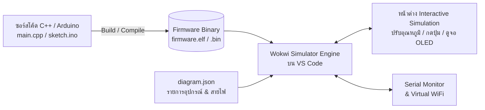

# 📘 คู่มือการจำลองการทำงาน IoT ด้วย Wokwi Simulator บน Visual Studio Code (VS Code)

คู่มือฉบับสมบูรณ์สำหรับผู้สอนและผู้เรียน เพื่อใช้จำลองการทำงานของบอร์ดไมโครคอนโทรลเลอร์ **ESP32 / ESP8266** ร่วมกับเซ็นเซอร์ จอแสดงผล และรีเลย์ ผ่าน **Wokwi Simulator Extension** บนโปรแกรม **Visual Studio Code** โดยไม่ต้องใช้อุปกรณ์จริง ช่วยให้สามารถทดสอบโค้ด ดีบัก และเรียนรู้นอกห้องปฏิบัติการได้อย่างมีประสิทธิภาพ 100%

---

## 📑 สารบัญ
1. [ภาพรวมและประโยชน์ของการจำลองบน VS Code](#1-ภาพรวมและประโยชน์ของการจำลองบน-vs-code)
2. [สิ่งที่ต้องเตรียมล่วงหน้า (Prerequisites)](#2-สิ่งที่ต้องเตรียมล่วงหน้า-prerequisites)
3. [การติดตั้งและตั้งค่า Wokwi Extension บน VS Code](#3-การติดตั้งและตั้งค่า-wokwi-extension-บน-vs-code)
4. [โครงสร้างไฟล์ของโปรเจกต์ Wokwi](#4-โครงสร้างไฟล์ของโปรเจกต์-wokwi)
5. [การตั้งค่าและรันด้วย PlatformIO (แนะนำ)](#5-การตั้งค่าและรันด้วย-platformio-แนะนำ)
6. [การตั้งค่าและรันด้วย Arduino CLI / Arduino IDE](#6-การตั้งค่าและรันด้วย-arduino-cli--arduino-ide)
7. [ตัวอย่างโปรเจกต์สมบูรณ์ (ESP32 + DHT22 + OLED + Relay + MQTT)](#7-ตัวอย่างโปรเจกต์สมบูรณ์)
8. [การจำลองระบบเครือข่าย WiFi และอินเทอร์เน็ต (Wokwi-GUEST)](#8-การจำลองระบบเครือข่าย-wifi-และอินเทอร์เน็ต)
9. [รายการชิ้นส่วนและพินไดอะแกรม (`diagram.json` Parts Reference)](#9-รายการชิ้นส่วนและพินไดอะแกรม)
10. [การใช้งาน Logic Analyzer เพื่อตรวจวัดสัญญาณดิจิทัล](#10-การใช้งาน-logic-analyzer-เพื่อตรวจวัดสัญญาณดิจิทัล)
11. [การแก้ปัญหาที่พบบ่อย (Troubleshooting & FAQ)](#11-การแก้ปัญหาที่พบบ่อย-troubleshooting--faq)

---

## 1. ภาพรวมและประโยชน์ของการจำลองบน VS Code



### ทำไมต้องใช้ Wokwi บน VS Code?
- **ปลอดภัย 100%:** ป้องกันความเสียหายจากการต่อสายไฟลัดวงจร (Short circuit) หรือจ่ายไฟเกินขนาด
- **ทำงานได้ทุกที่ทุกเวลา:** ผู้เรียนสามารถทำการทดลองที่บ้านหรือนอกเวลาเรียนได้โดยไม่ต้องพกพาชุดกล่องแล็บ
- **ประหยัดเวลาในการเตรียมอุปกรณ์:** ไม่ต้องเสียเวลากับสายไฟหลวม หรือเซ็นเซอร์ชำรุด
- **จำลองเน็ตเวิร์กได้จริง:** สามารถต่อ WiFi เสมือน `Wokwi-GUEST` เพื่อส่งข้อมูลขึ้น Cloud MQTT Broker (เช่น EMQX, HiveMQ) ได้แบบเรียลไทม์

---

## 2. สิ่งที่ต้องเตรียมล่วงหน้า (Prerequisites)

1. **โปรแกรม Visual Studio Code** ([ดาวน์โหลด code.visualstudio.com](https://code.visualstudio.com))
2. **เครื่องมือคอมไพล์โปรแกรม (เลือกอย่างใดอย่างหนึ่ง):**
   - **PlatformIO IDE Extension** (แนะนำเป็นลำดับแรก ใช้งานง่าย จัดการไลบรารีอัตโนมัติ)
   - **Arduino CLI** หรือ **Arduino IDE 2.x**

---

## 3. การติดตั้งและตั้งค่า Wokwi Extension บน VS Code

### ขั้นตอนที่ 3.1: ติดตั้ง Extension
1. เปิด VS Code กดคีย์ลัด `Ctrl + Shift + X` (Windows/Linux) หรือ `Cmd + Shift + X` (macOS) เพื่อเปิดแท็บ **Extensions**
2. พิมพ์ค้นหา: `Wokwi Simulator` (ผู้พัฒนา: Wokwi)
3. คลิกปุ่ม **Install**

```
+-------------------------------------------------------------+
|  🧩 Extensions: Marketplace                                |
|  [ Wokwi Simulator                    ]                     |
|  ---------------------------------------------------------  |
|  Wokwi Simulator  [Install]                                 |
|  Simulate Arduino, ESP32, and Raspberry Pi Pico in VS Code  |
+-------------------------------------------------------------+
```

### ขั้นตอนที่ 3.2: การขอรับสิทธิ์ License Token (ฟรีสำหรับบุคคลทั่วไป)
1. กดคีย์ลัด `F1` หรือ `Ctrl + Shift + P` (`Cmd + Shift + P` บน macOS)
2. พิมพ์คำสั่ง: `Wokwi: Request License` แล้วกด **Enter**
3. เบราว์เซอร์จะเปิดหน้าเว็บ Wokwi ให้เข้าสู่ระบบด้วยบัญชี Google หรือ GitHub
4. คลิกปุ่ม **Get your License Token** เพื่อเปิดใช้งานบน VS Code

---

## 4. โครงสร้างไฟล์ของโปรเจกต์ Wokwi

โฟลเดอร์โปรเจกต์สำหรับการรัน Wokwi ต้องมีโครงสร้างไฟล์ดังนี้:

```text
📁 iot-wokwi-project/
├── 📄 wokwi.toml            <-- กำหนดตำแหน่งไฟล์ Binary Firmware (.elf / .bin)
├── 📄 diagram.json          <-- กำหนดรายการชิ้นส่วนและการเชื่อมต่อสายไฟ (Wiring)
├── 📄 platformio.ini        <-- (กรณีใช้งานร่วมกับ PlatformIO)
└── 📁 src/
    └── 📄 main.cpp          <-- ซอร์สโค้ดโปรแกรมหลัก
```

---

## 5. การตั้งค่าและรันด้วย PlatformIO (แนะนำ)

### 5.1 สร้างไฟล์ `platformio.ini`
กำหนดค่าบอร์ด อัตราเร็ว Serial และรายชื่อไลบรารีที่ต้องใช้งาน:

```ini
[env:esp32dev]
platform = espressif32
board = esp32dev
framework = arduino
monitor_speed = 115200
lib_deps =
    adafruit/DHT sensor library@^1.4.4
    adafruit/Adafruit Unified Sensor@^1.1.9
    adafruit/Adafruit SSD1306@^2.5.7
    adafruit/Adafruit GFX Library@^1.11.5
    knolleary/PubSubClient@^2.8
```

### 5.2 สร้างไฟล์ `wokwi.toml`
ระบุตำแหน่งไฟล์ `.elf` ที่ได้จากการคอมไพล์ของ PlatformIO:

```toml
[wokwi]
version = 1
firmware = '.pio/build/esp32dev/firmware.elf'
elf = '.pio/build/esp32dev/firmware.elf'
```

### 5.3 ขั้นตอนการสั่งคอมไพล์และเริ่มรัน Simulator
1. กดปุ่ม **Build** (เครื่องหมายถูก $\checkmark$) บนแถบสถานะด้านล่างของ PlatformIO เพื่อคอมไพล์
2. ดับเบิลคลิกเปิดไฟล์ `diagram.json`
3. จะปรากฏปุ่ม **Start Simulation (Play ▶)** ที่มุมขวาบนของหน้าต่าง Editor หรือกด `F1` $\rightarrow$ เลือก `Wokwi: Start Simulator`

---

## 6. การตั้งค่าและรันด้วย Arduino CLI / Arduino IDE

หากต้องการใช้งานกับโปรเจกต์ Arduino (`.ino`):

### 6.1 สร้างไฟล์ `wokwi.toml`
```toml
[wokwi]
version = 1
firmware = 'build/esp32.esp32.esp32/sketch.ino.bin'
elf = 'build/esp32.esp32.esp32/sketch.ino.elf'
```

### 6.2 คำสั่งคอมไพล์ผ่าน Terminal
```bash
# สำหรับบอร์ด ESP32 Dev Module
arduino-cli compile --fqbn esp32:esp32:esp32 --build-path ./build sketch.ino
```

---

## 7. ตัวอย่างโปรเจกต์สมบูรณ์

### 7.1 ผังวงจรในไฟล์ `diagram.json`
บันทึกเป็นไฟล์ `diagram.json` (ประกอบด้วย: ESP32 + เซ็นเซอร์ DHT22 + จอ OLED I2C + รีเลย์ควบคุมพัดลม + ปุ่มกด Active-LOW):

```json
{
  "version": 1,
  "author": "IoT Lab Development Team",
  "editor": "wokwi",
  "parts": [
    { "type": "board-esp32-devkit-c-v4", "id": "esp", "top": 0, "left": 0, "attrs": {} },
    { "type": "wokwi-dht22", "id": "dht", "top": -140, "left": -120, "attrs": {} },
    { "type": "board-ssd1306", "id": "oled", "top": -140, "left": 130, "attrs": { "i2cAddress": "0x3c" } },
    { "type": "wokwi-relay-module", "id": "relay", "top": 150, "left": 130, "attrs": {} },
    { "type": "wokwi-pushbutton", "id": "btn", "top": 150, "left": -120, "attrs": { "color": "green" } }
  ],
  "connections": [
    [ "esp:TX", "$serialMonitor:RX", "", [] ],
    [ "esp:RX", "$serialMonitor:TX", "", [] ],

    [ "esp:GND.1", "dht:GND", "black", [ "v0" ] ],
    [ "esp:3V3", "dht:VCC", "red", [ "v0" ] ],
    [ "esp:33", "dht:SDA", "green", [ "v0" ] ],

    [ "esp:GND.2", "oled:GND", "black", [ "v0" ] ],
    [ "esp:3V3", "oled:VCC", "red", [ "v0" ] ],
    [ "esp:21", "oled:SDA", "blue", [ "v0" ] ],
    [ "esp:22", "oled:SCL", "yellow", [ "v0" ] ],

    [ "esp:GND.1", "relay:GND", "black", [ "v0" ] ],
    [ "esp:5V", "relay:VCC", "red", [ "v0" ] ],
    [ "esp:5", "relay:IN", "purple", [ "v0" ] ],

    [ "esp:GND.1", "btn:1.l", "black", [ "v0" ] ],
    [ "esp:0", "btn:2.l", "orange", [ "v0" ] ]
  ],
  "dependencies": {}
}
```

### 7.2 ซอร์สโค้ดภาษา C++ (`src/main.cpp`)

```cpp
#include <Arduino.h>
#include <WiFi.h>
#include <Wire.h>
#include <Adafruit_GFX.h>
#include <Adafruit_SSD1306.h>
#include <DHT.h>
#include <PubSubClient.h>

// --- Pin Definitions ---
#define DHTPIN        33
#define DHTTYPE       DHT22
#define RELAY_PIN     5
#define BUTTON_PIN    0
#define SCREEN_WIDTH  128
#define SCREEN_HEIGHT 64

// --- WiFi & MQTT Configuration ---
const char* ssid = "Wokwi-GUEST";
const char* password = "";
const char* mqtt_server = "broker.emqx.io";
const int mqtt_port = 1883;

// --- Objects ---
DHT dht(DHTPIN, DHTTYPE);
Adafruit_SSD1306 display(SCREEN_WIDTH, SCREEN_HEIGHT, &Wire, -1);
WiFiClient espClient;
PubSubClient client(espClient);

unsigned long lastPublish = 0;
bool relayState = false;

void setupWiFi() {
  Serial.print("Connecting to WiFi");
  WiFi.begin(ssid, password);
  while (WiFi.status() != WL_CONNECTED) {
    delay(500);
    Serial.print(".");
  }
  Serial.println("\nWiFi Connected! IP: " + WiFi.localIP().toString());
}

void reconnectMQTT() {
  while (!client.connected()) {
    Serial.print("Attempting MQTT connection...");
    String clientId = "ESP32Wokwi-" + String(random(0xffff), HEX);
    if (client.connect(clientId.c_str())) {
      Serial.println("connected to MQTT Broker!");
      client.subscribe("esp-node/control/cmd");
    } else {
      Serial.print("failed, rc=");
      Serial.print(client.state());
      Serial.println(" try again in 3 seconds");
      delay(3000);
    }
  }
}

void setup() {
  Serial.begin(115200);
  pinMode(RELAY_PIN, OUTPUT);
  pinMode(BUTTON_PIN, INPUT_PULLUP);
  digitalWrite(RELAY_PIN, LOW);

  dht.begin();

  if (!display.begin(SSD1306_SWITCHCAPVCC, 0x3C)) {
    Serial.println("SSD1306 allocation failed");
  }
  display.clearDisplay();
  display.setTextColor(SSD1306_WHITE);
  display.setTextSize(1);
  display.setCursor(0, 10);
  display.println("Wokwi IoT Node Init");
  display.display();

  setupWiFi();
  client.setServer(mqtt_server, mqtt_port);
}

void loop() {
  if (!client.connected()) {
    reconnectMQTT();
  }
  client.loop();

  // ตรวจจับการกดปุ่ม SW (GPIO 0)
  if (digitalRead(BUTTON_PIN) == LOW) {
    relayState = !relayState;
    digitalWrite(RELAY_PIN, relayState ? HIGH : LOW);
    Serial.println("Manual Button Pressed! Relay: " + String(relayState ? "ON" : "OFF"));
    delay(300); // debounce
  }

  // ส่งข้อมูลขึ้น MQTT ทุก 3 วินาที
  if (millis() - lastPublish > 3000) {
    lastPublish = millis();
    float temp = dht.readTemperature();
    float hum = dht.readHumidity();

    if (!isnan(temp) && !isnan(hum)) {
      // แสดงผลบนหน้าจอ OLED
      display.clearDisplay();
      display.setCursor(0, 0);
      display.println("== WOKWI IOT NODE ==");
      display.setCursor(0, 16);
      display.printf("Temp : %.1f C\n", temp);
      display.setCursor(0, 30);
      display.printf("Hum  : %.1f %%\n", hum);
      display.setCursor(0, 46);
      display.printf("Relay: %s\n", relayState ? "ACTIVE [ON]" : "IDLE [OFF]");
      display.display();

      // สร้างแพ็กเกจ JSON ส่งขึ้น Cloud MQTT
      String payload = "{\"temp\":" + String(temp, 1) + 
                       ",\"hum\":" + String(hum, 1) + 
                       ",\"relay\":" + (relayState ? "true" : "false") + "}";
      client.publish("esp-node/state", payload.c_str());
      Serial.println("Published: " + payload);
    }
  }
}
```

---

## 8. การจำลองระบบเครือข่าย WiFi และอินเทอร์เน็ต

Wokwi ให้การสนับสนุนระบบเน็ตเวิร์กจำลองที่สามารถเชื่อมต่อกับโลกอินเทอร์เน็ตจริงได้:

| การตั้งค่า | ค่าที่ต้องระบุ | คำอธิบาย |
| :--- | :--- | :--- |
| **SSID** | `"Wokwi-GUEST"` | ชื่อเครือข่าย WiFi เสมือนของ Wokwi (พิมพ์ตรงตามนี้) |
| **Password** | `""` | ปล่อยเป็นสตริงว่าง (ไม่ต้องใส่รหัสผ่าน) |
| **Protocols ที่รองรับ** | TCP, UDP, DNS, ICMP, DHCP | สามารถออกเน็ตไปยัง Public MQTT / REST API ได้ |
| **Localhost Access** | ใช้ Wokwi IoT Gateway | สำหรับเชื่อมต่อไปยังเซิร์ฟเวอร์บนเครื่องตัวเอง (`localhost`) |

---

## 9. รายการชิ้นส่วนและพินไดอะแกรม (`diagram.json` Parts Reference)

ตารางรหัสชิ้นส่วนที่ใช้งานบ่อยสำหรับการทำใบงาน IoT:

| อุปกรณ์ | Type ID ใน `diagram.json` | ขาสัญญาณหลัก |
| :--- | :--- | :--- |
| **ESP32 DevKit v4** | `board-esp32-devkit-c-v4` | 3V3, 5V, GND, GPIO0-39 |
| **ESP8266 NodeMCU** | `board-nodemcu-esp8266` | 3V3, GND, D0-D8, A0 |
| **เซ็นเซอร์อุณหภูมิ/ความชื้น** | `wokwi-dht22` หรือ `wokwi-dht11` | VCC, SDA (DATA), GND |
| **จอ OLED I2C 128x64** | `board-ssd1306` | VCC, GND, SDA, SCL |
| **โมดูลรีเลย์ 1 ช่อง** | `wokwi-relay-module` | VCC, GND, IN, NO, COM, NC |
| **ตัวต้านทานปรับค่าได้ (VR)** | `wokwi-potentiometer` | GND, SIG, VCC |
| **ปุ่มกด (Push Button)** | `wokwi-pushbutton` | 1.l, 2.l, 1.r, 2.r |
| **หลอดไฟ LED** | `wokwi-led` | A (Anode), C (Cathode) |
| **จอ LCD 1602 I2C** | `wokwi-lcd1602` | VCC, GND, SDA, SCL |

---

## 10. การใช้งาน Logic Analyzer เพื่อตรวจวัดสัญญาณดิจิทัล

Wokwi มีเครื่องมือวัดสัญญาณดิจิทัลในตัว เพื่อให้ผู้เรียนบันทึกคลื่นสัญญาณ I2C, SPI หรือ PWM ไปวิเคราะห์ต่อในโปรแกรม **PulseView**:

1. เพิ่มชิ้นส่วนลงใน `diagram.json`:
   ```json
   { "type": "wokwi-logic-analyzer", "id": "logic1", "top": -250, "left": 0, "attrs": {} }
   ```
2. ต่อขาพินที่ต้องการวัด เช่น ขา `esp:21` ไปยัง `logic1:D0`
3. เมื่อรัน Simulator ระบบจะบันทึกไฟล์สัญญาณดิจิทัลนามสกุล `.vcd` ให้ดาวน์โหลดไปเปิดดูใน **PulseView / Sigrok**

---

## 11. การแก้ปัญหาที่พบบ่อย (Troubleshooting & FAQ)

### ❓ ปัญหาที่ 1: กดปุ่ม Start Simulation แล้วขึ้นแจ้งเตือน `Firmware binary not found`
- **สาเหตุ:** ยังไม่ได้กดคอมไพล์โค้ด หรือระบุ Path ในไฟล์ `wokwi.toml` ไม่ถูกต้อง
- **วิธีแก้:**
  1. กดปุ่ม **Build** (เครื่องหมาย $\checkmark$) บน PlatformIO ให้สำเร็จก่อน
  2. ตรวจสอบว่ามีไฟล์ `.pio/build/esp32dev/firmware.elf` เกิดขึ้นจริงหรือไม่
  3. ตรวจสอบว่าชื่อ Environment ใน `platformio.ini` (เช่น `[env:esp32dev]`) ตรงกับโฟลเดอร์ใน `wokwi.toml`

### ❓ ปัญหาที่ 2: Serial Monitor ใน Wokwi ไม่แสดงผล หรือแสดงภาษาต่างดาว
- **สาเหตุ:** ค่า Baud rate ในโค้ดไม่ตรงกับที่กำหนดไว้
- **วิธีแก้:** ตรวจสอบคำสั่ง `Serial.begin(115200);` และใน `platformio.ini` ให้ระบุ `monitor_speed = 115200`

### ❓ ปัญหาที่ 3: จอ OLED หรือเซ็นเซอร์อ่านค่าไม่ได้ (`nan` หรือ จอมืด)
- **วิธีแก้:**
  1. ตรวจสอบ I2C Address ของจอ OLED ให้เป็น `0x3C` ในโค้ด `display.begin(SSD1306_SWITCHCAPVCC, 0x3C)`
  2. ตรวจสอบว่าต่อขา `SDA` เข้ากับ GPIO 21 และ `SCL` เข้ากับ GPIO 22 ของ ESP32 ถูกต้อง

### ❓ ปัญหาที่ 4: อุปกรณ์ไม่สามารถเชื่อมต่อ MQTT Broker ภายนอกได้
- **วิธีแก้:** ตรวจสอบว่าระบุชื่อ WiFi เป็น `Wokwi-GUEST` (ตัวพิมพ์ใหญ่-เล็กต้องถูกต้อง) และพาสเวิร์ดเป็นสตริงว่าง `""`

---

## 🎯 สรุปวงจรการทำงานประจำวัน (Quick Reference)

$$\boxed{\text{เขียน/แก้ไขโค้ด C++}} \xrightarrow{\text{Ctrl+Alt+B (Build)}} \boxed{\text{เปิด diagram.json}} \xrightarrow{\text{กดปุ่ม Play ▶}} \boxed{\text{ทดสอบและปรับ Slider ค่าเซ็นเซอร์}}$$
