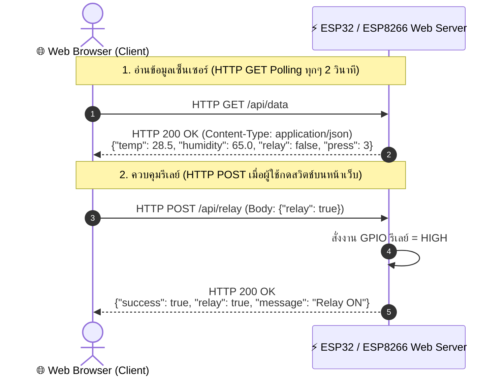

# ⚡ ใบงานที่ 3.2: การควบคุมอุปกรณ์และการอ่านค่าเซ็นเซอร์ผ่าน HTTP GET / POST (Web Server & REST API)

คู่มือการทดลองสร้าง Web Server บนไมโครคอนโทรลเลอร์ ESP32 / ESP8266 เพื่อให้บริการ REST API ด้วยเมธอด **HTTP GET** สำหรับอ่านค่าเซ็นเซอร์ DHT11 และ **HTTP POST** สำหรับสั่งการเปิด-ปิดรีเลย์ พร้อมเชื่อมโยงการต่อวงจรและพินฮาร์ดแวร์จากใบงานที่ 1 และ 2

---

## 🎯 วัตถุประสงค์ (Objectives)

1. เข้าใจหลักการทำงานของโปรโตคอล **HTTP (Request-Response Lifecycle)** ความแตกต่างระหว่างเมธอด **GET** และ **POST**
2. สามารถสร้าง **Web Server (Port 80)** บน ESP32 / ESP8266 เพื่อสร้าง REST API Endpoints:
   - `GET /api/data`: ส่งคืนข้อมูลอุณหภูมิ, ความชื้น, สถานะรีเลย์, และจำนวนกดปุ่มในรูปแบบ JSON
   - `POST /api/relay`: รับข้อมูล JSON Payload เพื่อสั่งควบคุมเปิด-ปิดรีเลย์พัดลม
3. สามารถเชื่อมต่อและใช้งานอุปกรณ์ฮาร์ดแวร์ร่วมกันตามมาตรฐานของใบงานที่ 1 และ 2 ได้แก่ เซ็นเซอร์ DHT11, รีเลย์, ปุ่มกดสวิตช์, และจอแสดงผล OLED SSD1306 (I2C)
4. สามารถพัฒนาหน้าเว็บ HTML/JavaScript Client เพื่ออ่านค่าด้วยเทคนิค **HTTP Polling (`fetch GET`)** และส่งคำสั่งควบคุมด้วย **`fetch POST`**

---

## 🔌 การต่อวงจรและพินฮาร์ดแวร์ (Hardware Pinouts)

ตารางเปรียบเทียบการต่อวงจรระหว่างบอร์ด **ESP32 (IPST-WiFi)** และ **ESP8266 (AX-WiFi)**:

| อุปกรณ์ / โมดูล | ขาสัญญาณ | บอร์ด ESP32 (IPST-WiFi) | บอร์ด ESP8266 (AX-WiFi) | คำอธิบายและหมายเหตุ |
| :--- | :--- | :--- | :--- | :--- |
| **DHT11 Sensor** | DATA | `GPIO 33` | `GPIO 2` (`D4`) / `GPIO 0` (`D3`) | วัดอุณหภูมิและความชื้นสัมพัทธ์ (ไฟเลี้ยง 3.3V) |
| **Relay 1 (พัดลม)** | IN | `GPIO 5` (พอร์ต 5) | `GPIO 13` (`D7`) | ควบคุมรีเลย์พัดลมระบายความร้อน (Active HIGH) |
| **ปุ่มกดสวิตช์** | SW / Input | `GPIO 0` (ปุ่ม SW1) | `GPIO 0` (`D3` / ปุ่ม FLASH) | สลับสถานะรีเลย์บนบอร์ดแบบ Manual (Active LOW) |
| **จอ OLED SSD1306** | SDA / SCL | `GPIO 21` / `GPIO 22` | `GPIO 4` (`D2`) / `GPIO 5` (`D1`) | I2C Address `0x3C` แสดง IP และสถานะระบบ |
| **Onboard LED** | LED | `GPIO 18` | `GPIO 2` (`D4`) | แสดงสถานะการทำงานของบอร์ด |

---

## 🌐 สถาปัตยกรรม REST API Endpoints

---

## ✍️ เฉลยคำตอบในใบงาน (Worksheet Answers)

### 1. โค้ดเติมคำตอบในโครงร่างโปรแกรม (Code Blanks)
* **ช่องที่ 1:** `server.on("/api/data", HTTP_GET, handleGetData);` $\rightarrow$ ลงทะเบียน Endpoint สำหรับ HTTP GET
* **ช่องที่ 2:** `server.on("/api/relay", HTTP_POST, handleSetRelay);` $\rightarrow$ ลงทะเบียน Endpoint สำหรับ HTTP POST
* **ช่องที่ 3:** `serializeJson(doc, jsonStr);` $\rightarrow$ แปลงข้อมูล JSON Document เป็น String
* **ช่องที่ 4:** `server.send(200, "application/json", jsonStr);` $\rightarrow$ ส่ง HTTP Response ตอบกลับไคลเอนต์
* **ช่องที่ 5:** `deserializeJson(doc, server.arg("plain"));` $\rightarrow$ ถอดรหัสข้อความ JSON Payload จาก HTTP POST Request Body

---

### 2. คำถามสรุปผลการทดลอง (Review Questions)

**คำถามที่ 1: เหตุใดการอ่านค่าเซ็นเซอร์จึงเหมาะสมกับการใช้เมธอด HTTP GET ในขณะที่การสั่งเปิด-ปิดรีเลย์จึงเหมาะสมกับการใช้ HTTP POST?**
> **แนวคำตอบ:** 
> - **HTTP GET** ถูกออกแบบมาเพื่อการ **"ขออ่าน/ดึงข้อมูล (Idempotent & Safe Retrieval)"** ซึ่งไม่มีผลข้างเคียง (Side Effect) ต่อสถานะของระบบ การดึงค่าเซ็นเซอร์ซ้ำๆ จึงไม่ทำให้ฮาร์ดแวร์เปลี่ยนแปลงสถานะ
> - **HTTP POST** ถูกออกแบบมาเพื่อการ **"ส่งข้อมูลเข้าไปเปลี่ยนแปลงสถานะหรือสั่งการทำงาน (State Mutation)"** มีการส่ง Payload ไว้ใน Request Body อย่างเป็นสัดส่วน ไม่แสดงข้อมูลบน URL ป้องกันการถูกแคช (Cache) โดยบราวเซอร์ และปลอดภัยต่อการสั่งเปิด-ปิดอุปกรณ์ฮาร์ดแวร์

**คำถามที่ 2: การใช้เทคนิค HTTP Polling เพื่ออ่านค่าเซ็นเซอร์แบบเรียลไทม์ส่งผลกระทบต่อประสิทธิภาพของไมโครคอนโทรลเลอร์อย่างไร และมีวิธีแก้ไขอย่างไร?**
> **แนวคำตอบ:** 
> - **ผลกระทบ:** HTTP Polling บราวเซอร์ต้องส่ง Request พร้อม HTTP Header ขนาดใหญ่ (~500–1000 Bytes) ไปยังไมโครคอนโทรลเลอร์ซ้ำๆ ทุก 1–2 วินาที ทำให้ ESP32/ESP8266 ต้องเปิด-ปิด TCP Connection ซ้ำซาก เปลืองหน่วยความจำ RAM และประมวลผล Header ตลอดเวลา จนอาจทำให้บอร์ดตอบสนองช้าลง (High Latency)
> - **แนวทางแก้ไข:** ในระบบที่ต้องการความถี่สูงและต้องการให้บอร์ดส่งข้อมูลหาเว็บได้ทันที (Event-driven) ควรเปลี่ยนไปใช้โปรโตคอล **WebSockets (Full-Duplex)** หรือ **MQTT Broker** ที่เปิดท่อ TCP ค้างไว้เพียงครั้งเดียวและมี Overhead ต่ำกว่ามาก
