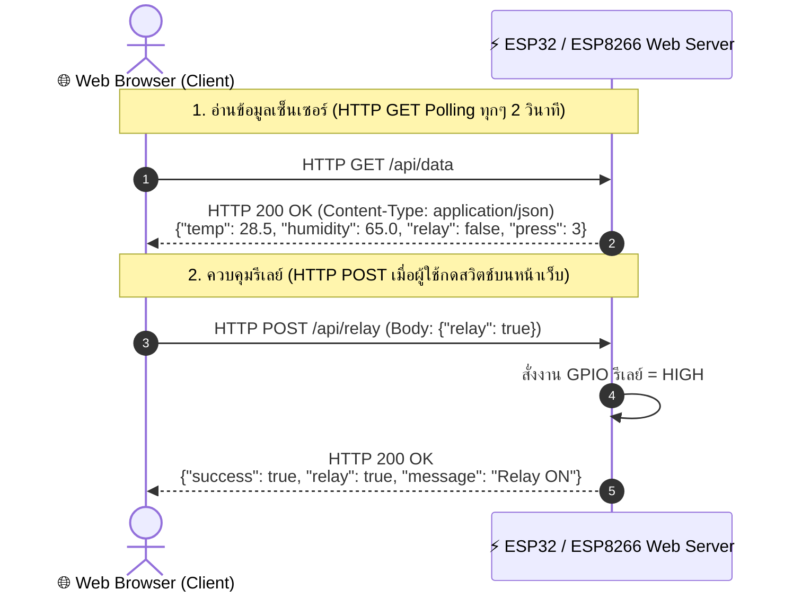

# ⚡ ใบงานที่ 3.2: การควบคุมอุปกรณ์และการอ่านค่าเซ็นเซอร์ผ่าน HTTP GET / POST (Web Server & REST API)

คู่มือการทดลองสร้าง Web Server บนไมโครคอนโทรลเลอร์ ESP32 / ESP8266 เพื่อให้บริการ REST API ด้วยเมธอด **HTTP GET** สำหรับอ่านค่าเซ็นเซอร์ DHT11 และ **HTTP POST** สำหรับสั่งการเปิด-ปิดรีเลย์ พร้อมเชื่อมโยงการต่อวงจรและพินฮาร์ดแวร์จากใบงานที่ 1 และ 2

---

## 🎯 วัตถุประสงค์ (Objectives)

1. เข้าใจหลักการทำงานของโปรโตคอล **HTTP (Request-Response Lifecycle)** ความแตกต่างระหว่างเมธอด **GET** และ **POST**
2. สามารถสร้าง **Web Server (Port 80)** บน ESP32 / ESP8266 เพื่อสร้าง REST API Endpoints:
   - `GET /api/data`: ส่งคืนข้อมูลอุณหภูมิ, ความชื้น, สถานะรีเลย์, และจำนวนกดปุ่มในรูปแบบ JSON
   - `POST /api/relay`: รับข้อมูล JSON Payload เพื่อสั่งควบคุมเปิด-ปิดรีเลย์พัดลม
3. สามารถเชื่อมต่อและใช้งานอุปกรณ์ฮาร์ดแวร์ร่วมกันตามมาตรฐานของใบงานที่ 1 และ 2 ได้แก่ เซ็นเซอร์ DHT11, รีเลย์, ปุ่มกดสวิตช์, และจอแสดงผล OLED SSD1306 (I2C)
4. สามารถพัฒนาหน้าเว็บ HTML/JavaScript Client เพื่ออ่านค่าด้วยเทคนิค **HTTP Polling (`fetch GET`)** และส่งคำสั่งควบคุมด้วย **`fetch POST`**

---

## 🔌 การต่อวงจรและพินฮาร์ดแวร์ (Hardware Pinouts)

ตารางเปรียบเทียบการต่อวงจรระหว่างบอร์ด **ESP32 (IPST-WiFi)** และ **ESP8266 (AX-WiFi)**:

| อุปกรณ์ / โมดูล | ขาสัญญาณ | บอร์ด ESP32 (IPST-WiFi) | บอร์ด ESP8266 (AX-WiFi) | คำอธิบายและหมายเหตุ |
| :--- | :--- | :--- | :--- | :--- |
| **DHT11 Sensor** | DATA | `GPIO 33` | `GPIO 2` (`D4`) / `GPIO 0` (`D3`) | วัดอุณหภูมิและความชื้นสัมพัทธ์ (ไฟเลี้ยง 3.3V) |
| **Relay 1 (พัดลม)** | IN | `GPIO 5` (พอร์ต 5) | `GPIO 13` (`D7`) | ควบคุมรีเลย์พัดลมระบายความร้อน (Active HIGH) |
| **ปุ่มกดสวิตช์** | SW / Input | `GPIO 0` (ปุ่ม SW1) | `GPIO 0` (`D3` / ปุ่ม FLASH) | สลับสถานะรีเลย์บนบอร์ดแบบ Manual (Active LOW) |
| **จอ OLED SSD1306** | SDA / SCL | `GPIO 21` / `GPIO 22` | `GPIO 4` (`D2`) / `GPIO 5` (`D1`) | I2C Address `0x3C` แสดง IP และสถานะระบบ |
| **Onboard LED** | LED | `GPIO 18` | `GPIO 2` (`D4`) | แสดงสถานะการทำงานของบอร์ด |

---

## 🌐 สถาปัตยกรรม REST API Endpoints



---

## ✍️ เฉลยคำตอบในใบงาน (Worksheet Answers)

### 1. โค้ดเติมคำตอบในโครงร่างโปรแกรม (Code Blanks)
* **ช่องที่ 1:** `server.on("/api/data", HTTP_GET, handleGetData);` $\rightarrow$ ลงทะเบียน Endpoint สำหรับ HTTP GET
* **ช่องที่ 2:** `server.on("/api/relay", HTTP_POST, handleSetRelay);` $\rightarrow$ ลงทะเบียน Endpoint สำหรับ HTTP POST
* **ช่องที่ 3:** `serializeJson(doc, jsonStr);` $\rightarrow$ แปลงข้อมูล JSON Document เป็น String
* **ช่องที่ 4:** `server.send(200, "application/json", jsonStr);` $\rightarrow$ ส่ง HTTP Response ตอบกลับไคลเอนต์
* **ช่องที่ 5:** `deserializeJson(doc, server.arg("plain"));` $\rightarrow$ ถอดรหัสข้อความ JSON Payload จาก HTTP POST Request Body

---

### 2. คำถามสรุปผลการทดลอง (Review Questions)

**คำถามที่ 1: เหตุใดการอ่านค่าเซ็นเซอร์จึงเหมาะสมกับการใช้เมธอด HTTP GET ในขณะที่การสั่งเปิด-ปิดรีเลย์จึงเหมาะสมกับการใช้ HTTP POST?**
> **แนวคำตอบ:** 
> - **HTTP GET** ถูกออกแบบมาเพื่อการ **"ขออ่าน/ดึงข้อมูล (Idempotent & Safe Retrieval)"** ซึ่งไม่มีผลข้างเคียง (Side Effect) ต่อสถานะของระบบ การดึงค่าเซ็นเซอร์ซ้ำๆ จึงไม่ทำให้ฮาร์ดแวร์เปลี่ยนแปลงสถานะ
> - **HTTP POST** ถูกออกแบบมาเพื่อการ **"ส่งข้อมูลเข้าไปเปลี่ยนแปลงสถานะหรือสั่งการทำงาน (State Mutation)"** มีการส่ง Payload ไว้ใน Request Body อย่างเป็นสัดส่วน ไม่แสดงข้อมูลบน URL ป้องกันการถูกแคช (Cache) โดยบราวเซอร์ และปลอดภัยต่อการสั่งเปิด-ปิดอุปกรณ์ฮาร์ดแวร์

**คำถามที่ 2: การใช้เทคนิค HTTP Polling เพื่ออ่านค่าเซ็นเซอร์แบบเรียลไทม์ส่งผลกระทบต่อประสิทธิภาพของไมโครคอนโทรลเลอร์อย่างไร และมีวิธีแก้ไขอย่างไร?**
> **แนวคำตอบ:** 
> - **ผลกระทบ:** HTTP Polling บราวเซอร์ต้องส่ง Request พร้อม HTTP Header ขนาดใหญ่ (~500–1000 Bytes) ไปยังไมโครคอนโทรลเลอร์ซ้ำๆ ทุก 1–2 วินาที ทำให้ ESP32/ESP8266 ต้องเปิด-ปิด TCP Connection ซ้ำซาก เปลืองหน่วยความจำ RAM และประมวลผล Header ตลอดเวลา จนอาจทำให้บอร์ดตอบสนองช้าลง (High Latency)
> - **แนวทางแก้ไข:** ในระบบที่ต้องการความถี่สูงและต้องการให้บอร์ดส่งข้อมูลหาเว็บได้ทันที (Event-driven) ควรเปลี่ยนไปใช้โปรโตคอล **WebSockets (Full-Duplex)** หรือ **MQTT Broker** ที่เปิดท่อ TCP ค้างไว้เพียงครั้งเดียวและมี Overhead ต่ำกว่ามาก

---

## 🏆 3. แนวทางการทำโจทย์ท้าทาย (Challenge Task Guide)

### 📋 เงื่อนไขโจทย์ท้าทาย:
1. **การควบคุม HTTP POST ขั้นสูง:** พัฒนาฟังก์ชัน `handleSetRelay()` ให้รองรับการส่ง JSON แบบระบุคำสั่ง เช่น `{"action": "toggle"}` หรือ `{"relay": true/false}` พร้อมส่งข้อความตอบกลับ `{"success": true, "relay": state, "message": "..."}`
2. **การแสดงผลจอ OLED SSD1306 (I2C 0x3C):** แสดงผล IP Address ของบอร์ด, อุณหภูมิ, ความชื้น, สถานะรีเลย์ (ON/OFF), และตัวนับการกดปุ่ม
3. **ระบบสวิตช์กายภาพ (GPIO 0 Debounce):** ดักจับการกดปุ่ม SW1 บนบอร์ด IPST-WiFi หรือปุ่ม FLASH บนบอร์ด AX-WiFi เพื่อสลับสถานะรีเลย์ พร้อมอัปเดตตัวแปร `toggleCount` และสะท้อนไปยัง REST API
4. **CORS Support:** ใส่ Header `Access-Control-Allow-Origin: *` และรองรับ `HTTP_OPTIONS` เพื่อให้ Web App บน Localhost หรือโดเมนอื่นส่ง Request ข้ามโดเมนได้

---

## 💻 4. โค้ดเฉลยโจทย์ท้าทายฉบับสมบูรณ์ (Complete Solution Code)

```cpp
/**
 * Lab 3.2: HTTP GET / POST Web Server & REST API (Complete Solution)
 */
#include <Arduino.h>
#include <Wire.h>
#include <Adafruit_GFX.h>
#include <Adafruit_SSD1306.h>
#if defined(ESP8266)
#include <ESP8266WiFi.h>
#include <ESP8266WebServer.h>
#elif defined(ESP32)
#include <WiFi.h>
#include <WebServer.h>
#endif
#include <ArduinoJson.h>
#include <DHT.h>

const char* ssid = "iot_512";
const char* password = "iot123456";

#if defined(ESP8266)
ESP8266WebServer server(80);
#define DHTPIN 2
#define FAN_RELAY_PIN 13
#define BUTTON_PIN 0
#elif defined(ESP32)
WebServer server(80);
#define DHTPIN 33
#define FAN_RELAY_PIN 5
#define BUTTON_PIN 0
#endif

#define DHTTYPE DHT11
DHT dht(DHTPIN, DHTTYPE);

Adafruit_SSD1306 display(128, 64, &Wire, -1);
bool oledAvailable = false;

float temperature = 0.0;
float humidity = 0.0;
bool relayState = false;
int toggleCount = 0;

void updateOledDisplay(const char* statusMsg = "") {
  if (!oledAvailable) return;
  display.clearDisplay();
  display.setCursor(8, 0);
  display.print("HTTP REST SERVER");
  display.drawLine(0, 10, 128, 10, SSD1306_WHITE);
  display.setCursor(0, 14);
  display.printf("Temp: %.1f C", temperature);
  display.setCursor(0, 24);
  display.printf("Humid: %.1f %%", humidity);
  display.setCursor(0, 35);
  if (statusMsg && strlen(statusMsg) > 0) display.print(statusMsg);
  else display.printf("IP: %s", WiFi.localIP().toString().c_str());
  display.drawLine(0, 48, 128, 48, SSD1306_WHITE);
  display.setCursor(0, 52);
  display.printf("Fan:%s | Cnt:%d", relayState ? "ON" : "OFF", toggleCount);
  display.display();
}

void handleGetData() {
  server.sendHeader("Access-Control-Allow-Origin", "*");
  JsonDocument doc;
  doc["temp"] = isnan(temperature) ? 0.0 : (round(temperature * 10.0) / 10.0);
  doc["humidity"] = isnan(humidity) ? 0.0 : (round(humidity * 10.0) / 10.0);
  doc["relay"] = relayState;
  doc["press"] = toggleCount;
  doc["ip"] = WiFi.localIP().toString();
  String jsonStr;
  serializeJson(doc, jsonStr);
  server.send(200, "application/json", jsonStr);
}

void handleSetRelay() {
  server.sendHeader("Access-Control-Allow-Origin", "*");
  if (!server.hasArg("plain")) {
    server.send(400, "application/json", "{\"error\": \"Missing Request Body\"}");
    return;
  }
  JsonDocument doc;
  if (deserializeJson(doc, server.arg("plain"))) {
    server.send(400, "application/json", "{\"error\": \"Invalid JSON\"}");
    return;
  }
  if (doc["relay"].is<JsonVariant>()) {
    relayState = doc["relay"];
  } else if (doc["action"].is<JsonVariant>() && doc["action"] == "toggle") {
    relayState = !relayState;
  }
  digitalWrite(FAN_RELAY_PIN, relayState ? HIGH : LOW);
  updateOledDisplay("Relay Updated!");

  JsonDocument resDoc;
  resDoc["success"] = true;
  resDoc["relay"] = relayState;
  resDoc["message"] = relayState ? "Fan Relay Turned ON" : "Fan Relay Turned OFF";
  String resStr;
  serializeJson(resDoc, resStr);
  server.send(200, "application/json", resStr);
}

void setup() {
  Serial.begin(115200);
  dht.begin();
  pinMode(FAN_RELAY_PIN, OUTPUT);
  digitalWrite(FAN_RELAY_PIN, LOW);
  pinMode(BUTTON_PIN, INPUT_PULLUP);

  #if defined(ESP8266)
  Wire.begin(4, 5);
  #elif defined(ESP32)
  Wire.begin(21, 22);
  #endif

  if (display.begin(SSD1306_SWITCHCAPVCC, 0x3C)) {
    oledAvailable = true;
    display.clearDisplay();
    display.setTextColor(SSD1306_WHITE);
    display.setTextSize(1);
    updateOledDisplay("Connecting WiFi...");
  }

  WiFi.begin(ssid, password);
  while (WiFi.status() != WL_CONNECTED) delay(500);

  server.on("/api/data", HTTP_GET, handleGetData);
  server.on("/api/relay", HTTP_POST, handleSetRelay);
  server.begin();
  updateOledDisplay();
}

void loop() {
  server.handleClient();

  // Button Debounce
  int reading = digitalRead(BUTTON_PIN);
  static bool lastBtn = HIGH;
  static unsigned long lastDebounce = 0;
  if (reading != lastBtn) lastDebounce = millis();
  if ((millis() - lastDebounce) > 50) {
    static bool currentBtn = HIGH;
    if (reading != currentBtn) {
      currentBtn = reading;
      if (currentBtn == LOW) {
        relayState = !relayState;
        toggleCount++;
        digitalWrite(FAN_RELAY_PIN, relayState ? HIGH : LOW);
        updateOledDisplay("Btn Pressed!");
      }
    }
  }
  lastBtn = reading;

  // Sensor Reading every 2s
  static unsigned long lastRead = 0;
  if (millis() - lastRead > 2000) {
    lastRead = millis();
    float t = dht.readTemperature();
    float h = dht.readHumidity();
    if (!isnan(t)) temperature = t;
    if (!isnan(h)) humidity = h;
    updateOledDisplay();
  }
}
```

