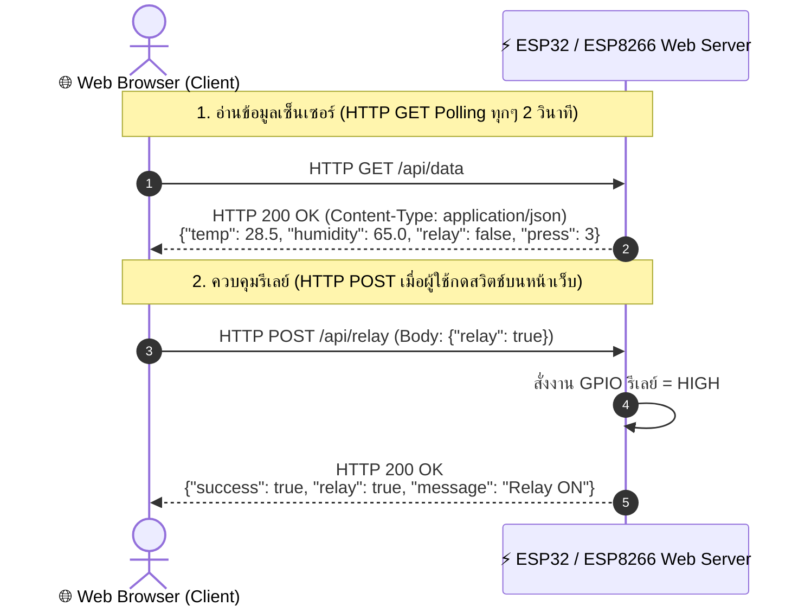

# ⚡ คู่มือการปฏิบัติการ ใบงานที่ 4.1: การควบคุมอุปกรณ์และการอ่านค่าเซ็นเซอร์ผ่าน HTTP GET / POST (REST API)

คู่มือการทดลองสร้าง Web Server บนไมโครคอนโทรลเลอร์ ESP32 / ESP8266 เพื่อให้บริการ REST API ด้วยเมธอด **HTTP GET** สำหรับอ่านค่าเซ็นเซอร์ DHT11 และ **HTTP POST** สำหรับสั่งการเปิด-ปิดรีเลย์ พร้อมเชื่อมโยงการต่อวงจรและพินฮาร์ดแวร์จากใบงานที่ 1 และ 2

---

## 🎯 1. วัตถุประสงค์การเรียนรู้ (Objectives)

1. เข้าใจหลักการทำงานของโปรโตคอล **HTTP (Request-Response Lifecycle)** และความแตกต่างระหว่างเมธอด **GET** และ **POST**
2. สามารถสร้าง **Web Server (Port 80)** บน ESP32 / ESP8266 เพื่อสร้าง REST API Endpoints:
   - `GET /api/data`: ส่งคืนข้อมูลอุณหภูมิ, ความชื้น, สถานะรีเลย์, และจำนวนกดปุ่มในรูปแบบ JSON
   - `POST /api/relay`: รับข้อมูล JSON Payload เพื่อสั่งควบคุมเปิด-ปิดรีเลย์พัดลม
3. สามารถเชื่อมต่อและใช้งานอุปกรณ์ฮาร์ดแวร์ร่วมกัน ได้แก่ เซ็นเซอร์ DHT11, รีเลย์, ปุ่มกดสวิตช์ GPIO 0, และจอแสดงผล OLED SSD1306 (I2C)
4. สามารถพัฒนาหน้าเว็บ HTML/JavaScript Client เพื่ออ่านค่าด้วยเทคนิค **HTTP Polling (`fetch GET`)** และส่งคำสั่งควบคุมด้วย **`fetch POST`**

---

## 🔌 2. รายการอุปกรณ์และการเชื่อมต่อวงจร (Hardware Wiring)

| อุปกรณ์ / โมดูล | ขาสัญญาณ | ESP32 (IPST-WiFi) | ESP8266 (AX-WiFi) | คำอธิบายและหมายเหตุ |
| :--- | :--- | :--- | :--- | :--- |
| **DHT11 Sensor** | DATA (Out) | GPIO 33 | GPIO 2 (D4) | วัดอุณหภูมิและความชื้นสัมพัทธ์ (ไฟเลี้ยง 3.3V) |
| **Relay 1 (พัดลม)** | IN (Signal) | GPIO 5 | GPIO 13 (D7) | ควบคุมเปิด-ปิดพัดลมระบายความร้อน (Active HIGH) |
| **ปุ่มกดสวิตช์** | SW / Input | GPIO 0 (SW1) | GPIO 0 (FLASH) | สลับสถานะรีเลย์บนบอร์ดแบบ Manual (Active LOW) |
| **จอ OLED SSD1306** | SDA / SCL | GPIO 21 / 22 | GPIO 4 / 5 (D2/D1) | I2C Address `0x3C` แสดง IP และสถานะระบบ |
| **Onboard LED** | LED | GPIO 18 | GPIO 2 (D4) | แสดงสถานะการทำงานของบอร์ด |

---

## 🌐 3. สถาปัตยกรรม REST API Endpoints

---

## ✍️ 4. เฉลยช่องว่างโค้ดโปรแกรม (Code Blanks)

1. **ช่องที่ 1:** `server.on("/api/data", HTTP_GET, handleGetData)` $\rightarrow$ ลงทะเบียน Endpoint สำหรับ HTTP GET
2. **ช่องที่ 2:** `server.on("/api/relay", HTTP_POST, handleSetRelay)` $\rightarrow$ ลงทะเบียน Endpoint สำหรับ HTTP POST
3. **ช่องที่ 3:** `serializeJson(doc, jsonStr)` $\rightarrow$ แปลงข้อมูล JSON Document เป็น String
4. **ช่องที่ 4:** `server.send(200, "application/json", jsonStr)` $\rightarrow$ ส่ง HTTP Response ตอบกลับไคลเอนต์
5. **ช่องที่ 5:** `deserializeJson(doc, server.arg("plain"))` $\rightarrow$ ถอดรหัสข้อความ JSON Payload จาก HTTP POST Request Body

---

## 🧠 5. เฉลยแบบทดสอบและคำถามท้ายการทดลอง

### แบบทดสอบปรนัย (Quiz):
* **ข้อที่ 1 (ตอบ ข - 1b):** GET เป็นการร้องขออ่านข้อมูลโดยไม่มี Side Effect (Idempotent) ส่วน POST ใช้ส่ง Payload เพื่อเปลี่ยนแปลงสถานะของระบบ
* **ข้อที่ 2 (ตอบ ก - 2a):** `Content-Type: application/json` บอกให้ Web Browser ทราบว่าข้อมูลตอบกลับเป็นโครงสร้าง JSON เพื่อให้ JavaScript ถอดรหัสได้ทันที
* **ข้อที่ 3 (ตอบ ก - 3a):** `server.arg("plain")` ดึงข้อมูลดิบในส่วน Request Body (JSON Payload) ที่ส่งมาจาก Client
* **ข้อที่ 4 (ตอบ ก - 4a):** ข้อจำกัดของ HTTP Polling คือสิ้นเปลืองแบนด์วิดท์จาก HTTP Header และเกิดการเปิด-ปิด TCP Connection ซ้ำๆ ทำให้ไมโครคอนโทรลเลอร์มีภาระสูง
* **ข้อที่ 5 (ตอบ ก - 5a):** `JsonDocument doc` ช่วยป้องกันข้อผิดพลาดของไวยากรณ์ JSON และจัดการ Memory Buffer อัตโนมัติอย่างปลอดภัย

### คำถามวิเคราะห์เชิงลึก:
1. **เหตุใดการอ่านค่าจึงใช้ GET และการควบคุมจึงใช้ POST?**
   > ตามมาตรฐาน HTTP เมธอด GET เป็น Safe & Idempotent Method คือการเรียกซ้ำกี่ครั้งก็ไม่เปลี่ยนแปลงสถานะของเซิร์ฟเวอร์ เหมาะกับการอ่านค่าเซ็นเซอร์ ส่วน POST ใช้สำหรับส่งข้อมูลไปประมวลผลและสร้างความเปลี่ยนแปลงแก่สถานะฮาร์ดแวร์ (State Mutation) เช่น การสั่งเปิด-ปิดรีเลย์
2. **ผลกระทบของ HTTP Polling ต่อไมโครคอนโทรลเลอร์?**
   > HTTP Polling ทำให้บอร์ดต้องรับและตอบคำขอพร้อม HTTP Header ขนาดใหญ่ซ้ำๆ ทุก 1-2 วินาที ต้องจัดสรร Buffer และประมวลผล TCP Handshake ตลอดเวลา ทำให้สูญเสียรอบการทำงานของ CPU และเปลือง RAM หากต้องการส่งข้อมูลแบบสองทางเรียลไทม์ ควรเลือกใช้ **WebSockets (Port 81)** แทน
3. **ความจำเป็นของ Header CORS (`Access-Control-Allow-Origin: *`)?**
   > เป็นมาตรฐานความปลอดภัยของเบราว์เซอร์ (Same-Origin Policy) ที่ป้องกันไม่ให้สคริปต์จากโดเมนหนึ่งส่งคำขอไปยังอีกโดเมนหนึ่ง หากไม่ใส่ Header นี้ เบราว์เซอร์จะบล็อกคำขอ AJAX/Fetch และแจ้งข้อผิดพลาด CORS Policy ทันที
