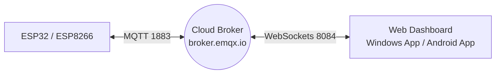

# คู่มือการเรียนรู้ Lab 5: Cloud MQTT & Cross-Platform Dashboard (Windows & Android)

คู่มือนี้จะอธิบายขั้นตอนการพัฒนาระบบ IoT ตั้งแต่การเขียนโค้ดบอร์ดไมโครคอนโทรลเลอร์ (ESP32 / ESP8266) การดึงข้อมูลและควบคุมผ่าน Cloud MQTT Broker, การออกแบบแดชบอร์ดหน้าเว็บ ไปจนถึงการแพ็กเกจเป็นแอปเดสก์ท็อปบน Windows (`.exe`) และแอปมือถือบน Android (`.apk`)

---

## สารบัญ
1. [ภาพรวมของระบบและสถาปัตยกรรม](#1-ภาพรวมของระบบและสถาปัตยกรรม)
2. [ขั้นตอนที่ 1: การเขียนโค้ดฝั่งบอร์ดไมโครคอนโทรลเลอร์ (C++ / PlatformIO)](#ขั้นตอนที่-1-การเขียนโค้ดฝั่งบอร์ดไมโครคอนโทรลเลอร์-c--platformio)
3. [ขั้นตอนที่ 2: การพัฒนาหน้าเว็บแดชบอร์ดเรียลไทม์ (HTML / CSS / JS)](#ขั้นตอนที่-2-การพัฒนาหน้าเว็บแดชบอร์ดเรียลไทม์-html--css--js)
4. [ขั้นตอนที่ 3: การสร้างแอปพลิเคชันเดสก์ท็อป Windows (.exe)](#ขั้นตอนที่-3-การสร้างแอปพลิเคชันเดสก์ท็อป-windows-exe)
5. [ขั้นตอนที่ 4: การสร้างแอปพลิเคชันมือถือ Android (.apk)](#ขั้นตอนที่-4-การสร้างแอปพลิเคชันมือถือ-android-apk)

---

## 1. ภาพรวมของระบบและสถาปัตยกรรม

ในการทดลองนี้ อุปกรณ์ฮาร์ดแวร์จะส่งค่าเซ็นเซอร์ (อุณหภูมิ, ความชื้น, แอนะล็อกเปอร์เซ็นต์, จำนวนครั้งกดสวิตช์) ขึ้นไปยังอินเทอร์เน็ตผ่าน **Cloud MQTT Broker** ในรูปแบบของข้อความโครงสร้าง JSON และรับข้อสั่งการจากหน้าเว็บกลับไปควบคุมรีเลย์ (เปิด-ปิดพัดลมจำลอง)



### การตั้งค่าการสื่อสาร (MQTT Topics)
*   **บอร์ดส่งรายงานสถานะ (Publish):** ส่งข้อมูล JSON ไปยังหัวข้อ `esp-node/state` ทุกๆ 5 วินาที
    *   *ตัวอย่าง Payload:* `{"temp":28.5,"humidity":65.0,"soil":45.0,"fan":false,"press":3}`
*   **บอร์ดรอรับข้อสั่งการ (Subscribe):** รับข้อมูลควบคุม JSON จากหัวข้อ `esp-node/control/cmd`
    *   *ตัวอย่าง Payload:* `{"action":"toggle_fan","value":true}`

---

## ขั้นตอนที่ 1: การเขียนโค้ดฝั่งบอร์ดไมโครคอนโทรลเลอร์ (C++ / PlatformIO)

### 1.1 ติดตั้งไลบรารีในโปรเจกต์
เปิดไฟล์ `platformio.ini` และระบุไลบรารีที่จำเป็นต่อการพัฒนา (เพิ่ม GFX และ SSD1306 สำหรับจอ OLED):
```ini
lib_deps =
    adafruit/DHT sensor library @ ^1.4.6
    adafruit/Adafruit Unified Sensor @ ^1.1.14
    knolleary/PubSubClient @ ^2.8
    bblanchon/ArduinoJson @ ^7.0.4
    adafruit/Adafruit GFX Library @ ^1.11.9
    adafruit/Adafruit SSD1306 @ ^2.5.9
```

### 1.2 โค้ดโปรแกรมฝั่งบอร์ด (`src/main.cpp`)
โค้ดโปรแกรมด้านล่างรองรับการแสดงสถานะและการเชื่อมต่อสัญญาณออกทางจอภาพ OLED SSD1306 และใช้ได้ทั้งบอร์ด **ESP32 (IPST-WiFi)** และ **ESP8266 (AX-WiFi)**:

```cpp
#include <Arduino.h>
#include <Wire.h>
#include <Adafruit_GFX.h>
#include <Adafruit_SSD1306.h>
#if defined(ESP8266)
#include <ESP8266WiFi.h>
#else
#include <WiFi.h>
#endif
#include <PubSubClient.h>
#include <ArduinoJson.h>
#include <DHT.h>

const char* ssid = "iot_512";
const char* password = "iot123456";

// การตั้งค่าคลาวด์ MQTT
const char* mqttServer = "broker.emqx.io";
const int mqttPort = 1883;
const char* subTopic = "esp-node/control/cmd";
const char* pubTopic = "esp-node/state";
const char* mqttUser = "elec";
const char* mqttPassword = "elec1234";

WiFiClient espClient;
PubSubClient mqttClient(espClient);

#define SCREEN_WIDTH 128
#define SCREEN_HEIGHT 64
#define OLED_RESET -1
Adafruit_SSD1306 display(SCREEN_WIDTH, SCREEN_HEIGHT, &Wire, OLED_RESET);

// กำหนดขาพินสำหรับแต่ละสถาปัตยกรรมบอร์ด
#if defined(ESP8266)
#define DHTPIN 0            // GPIO 0 (D3)
#define ANALOG_PIN A0       // ขา A0
#define FAN_RELAY_PIN 13    // GPIO 13 (D7)
#define BUTTON_PIN 0        // ปุ่ม FLASH (D3)
#define ADC_RESOLUTION 1023.0
#elif defined(ESP32)
#define DHTPIN 33           // พอร์ต 33 สำหรับ IPST-WiFi
#define ANALOG_PIN 36       // KNOB-S สำหรับ IPST-WiFi
#define FAN_RELAY_PIN 5     // พอร์ต 5 สำหรับ IPST-WiFi
#define BUTTON_PIN 0        // ปุ่ม SW1
#define ADC_RESOLUTION 4095.0
#endif
#define DHTTYPE DHT11

DHT dht(DHTPIN, DHTTYPE);

float temperature = 0;
float humidity = 0;
float analogPercent = 0;
bool fanState = false;
int toggleCount = 0;

// ฟังก์ชันวาดค่าสถานะลงจอภาพ OLED
void updateOledDisplay(const char* statusMsg = "") {
  display.clearDisplay();
  
  // 1. เขียนข้อความพาดหัว
  display.setCursor(15, 0);
  display.print("CLOUD MQTT NODE");
  display.drawLine(0, 10, 128, 10, SSD1306_WHITE);
  
  // 2. แสดงค่าเซ็นเซอร์ที่อ่านได้
  display.setCursor(0, 14);
  if (isnan(temperature)) {
    display.print("Temp: -- C");
  } else {
    display.printf("Temp: %.1f C", temperature);
  }
  
  display.setCursor(0, 24);
  if (isnan(humidity)) {
    display.print("Humid: -- %%");
  } else {
    display.printf("Humid: %.1f %%", humidity);
  }
  
  display.setCursor(0, 34);
  display.printf("Analog: %.1f %%", analogPercent);
  
  // 3. แสดงสถานะเน็ตเวิร์ก
  display.setCursor(0, 44);
  if (statusMsg && strlen(statusMsg) > 0) {
    display.print(statusMsg);
  } else {
    display.printf("MQTT: %s", mqttClient.connected() ? "Connected" : "Offline");
  }
  
  // 4. แสดงสถานะรีเลย์และตัวนับการกดปุ่ม
  display.drawLine(0, 53, 128, 53, SSD1306_WHITE);
  display.setCursor(0, 56);
  display.printf("Fan:%s | Press:%d", fanState ? "ON" : "OFF", toggleCount);
  
  display.display();
}

// ฟังก์ชันรับส่งข้อมูลคำสั่งผ่าน MQTT (Callback)
void mqttCallback(char* topic, byte* payload, unsigned int length) {
  JsonDocument doc;
  DeserializationError error = deserializeJson(doc, payload, length);
  if (error) return;
  
  if (String(topic) == subTopic) {
    if (doc.containsKey("action")) {
      String action = doc["action"];
      if (action == "toggle_fan") {
        fanState = doc["value"];
        digitalWrite(FAN_RELAY_PIN, fanState ? HIGH : LOW);
        Serial.printf("MQTT Control: Fan toggled to %s\n", fanState ? "ON" : "OFF");
        updateOledDisplay("Command Recv!");
      }
    }
  }
}

// ฟังก์ชันเชื่อมต่อคลาวด์ใหม่
void reconnectMqtt() {
  while (!mqttClient.connected()) {
    Serial.print("Connecting to MQTT...");
    display.clearDisplay();
    display.setCursor(10, 10);
    display.print("MQTT Connecting...");
    display.display();
    
    #if defined(ESP8266)
    String clientId = "ESP8266-" + String(ESP.getChipId(), HEX);
    #elif defined(ESP32)
    String clientId = "ESP32-" + String((uint32_t)ESP.getEfuseMac(), HEX);
    #endif
    
    if (mqttClient.connect(clientId.c_str(), mqttUser, mqttPassword)) {
      Serial.println("connected");
      display.clearDisplay();
      display.setCursor(10, 10);
      display.print("MQTT Connected!");
      display.display();
      delay(1000);
      
      mqttClient.subscribe(subTopic);
      updateOledDisplay("Broker Connected");
    } else {
      delay(5000);
    }
  }
}

void setup() {
  Serial.begin(115200);
  dht.begin();
  pinMode(FAN_RELAY_PIN, OUTPUT);
  pinMode(BUTTON_PIN, INPUT_PULLUP);
  digitalWrite(FAN_RELAY_PIN, LOW);
  
  #if defined(ESP32)
  analogSetPinAttenuation(ANALOG_PIN, ADC_11db);
  #endif

  // เริ่มต้นจอภาพ OLED
  #if defined(ESP8266)
  Wire.begin(4, 5); // SDA = GPIO 4 (D2), SCL = GPIO 5 (D1)
  #else
  Wire.begin(21, 22); // SDA = GPIO 21, SCL = GPIO 22
  #endif
  if(!display.begin(SSD1306_SWITCHCAPVCC, 0x3C)) { 
    Serial.println(F("SSD1306 allocation failed"));
  } else {
    display.clearDisplay();
    display.setTextSize(1);
    display.setTextColor(SSD1306_WHITE);
    display.setCursor(10, 20);
    display.print("System Booting...");
    display.display();
    delay(1500);
  }
  
  WiFi.begin(ssid, password);
  while (WiFi.status() != WL_CONNECTED) {
    display.clearDisplay();
    display.setCursor(10, 10);
    display.print("WiFi Connecting...");
    display.display();
    delay(500);
  }
  
  display.clearDisplay();
  display.setCursor(10, 10);
  display.print("WiFi Connected!");
  display.setCursor(10, 25);
  display.print(WiFi.localIP().toString());
  display.display();
  delay(1500);
  
  mqttClient.setServer(mqttServer, mqttPort);
  mqttClient.setCallback(mqttCallback);
}

void loop() {
  if (!mqttClient.connected()) {
    reconnectMqtt();
  }
  mqttClient.loop();
  
  int reading = digitalRead(BUTTON_PIN);
  static bool lastButtonState = HIGH;
  static bool currentButtonState = HIGH;
  static unsigned long lastDebounceTime = 0;
  
  if (reading != lastButtonState) {
    lastDebounceTime = millis();
  }
  if ((millis() - lastDebounceTime) > 50) {
    if (reading != currentButtonState) {
      currentButtonState = reading;
      if (currentButtonState == LOW) {
        fanState = !fanState;
        toggleCount++;
        digitalWrite(FAN_RELAY_PIN, fanState ? HIGH : LOW);
        updateOledDisplay("Button Pressed!");
        
        JsonDocument doc;
        doc["temp"] = temperature;
        doc["humidity"] = humidity;
        doc["soil"] = analogPercent;
        doc["fan"] = fanState;
        doc["press"] = toggleCount;
        String output;
        serializeJson(doc, output);
        mqttClient.publish(pubTopic, output.c_str());
      }
    }
  }
  lastButtonState = reading;
  
  static unsigned long lastUpdate = 0;
  if (millis() - lastUpdate > 5000) {
    lastUpdate = millis();
    temperature = dht.readTemperature();
    humidity = dht.readHumidity();
    int rawAnalog = analogRead(ANALOG_PIN);
    analogPercent = (rawAnalog / ADC_RESOLUTION) * 100.0;
    
    if (!isnan(temperature) && !isnan(humidity)) {
      updateOledDisplay();
      
      JsonDocument doc;
      doc["temp"] = temperature;
      doc["humidity"] = humidity;
      doc["soil"] = analogPercent;
      doc["fan"] = fanState;
      doc["press"] = toggleCount;
      String output;
      serializeJson(doc, output);
      mqttClient.publish(pubTopic, output.c_str());
    }
  }
}
```

---

## ขั้นตอนที่ 2: การพัฒนาหน้าเว็บแดชบอร์ดเรียลไทม์ (HTML / CSS / JS)

ในแล็บนี้ ตัวเว็บแดชบอร์ดจะรันโดยอิสระบนคอมพิวเตอร์ และคุยไปยังบอร์ดผ่านคลาวด์ โค้ดของแดชบอร์ดนี้ดีไซน์ด้วยกระจกโปร่งแสง (Glassmorphism) สไตล์มืด และเชื่อมต่อผ่าน **MQTT.js** เข้ามาที่พอร์ตคลาวด์ชนิดปลอดภัย `wss://broker.emqx.io:8084/mqtt`

เซฟไฟล์โค้ดนี้ในโปรเจกต์เป็น: **`data/index.html`**

```html
<!DOCTYPE html>
<html lang="th">
<head>
  <meta charset="UTF-8">
  <title>Cloud MQTT Real-time Dashboard</title>
  <!-- โหลดไลบรารี MQTT.js จาก CDN -->
  <script src="https://cdnjs.cloudflare.com/ajax/libs/mqtt/5.2.2/mqtt.min.js"></script>
  <style>
    :root {
      --bg: #0f172a; --card: rgba(30, 41, 59, 0.6); --text: #f8fafc; --accent: #6366f1;
    }
    body { background: var(--bg); color: var(--text); font-family: sans-serif; padding: 2rem; }
    .grid { display: grid; grid-template-columns: repeat(2, 1fr); gap: 1.5rem; max-width: 900px; margin: 0 auto; }
    .card { background: var(--card); border: 1px solid rgba(255,255,255,0.08); border-radius: 16px; padding: 2rem; }
    .value { font-size: 2.5rem; font-weight: bold; margin: 10px 0; }
    .switch-btn { padding: 10px 20px; background: var(--accent); color: white; border: none; border-radius: 8px; cursor: pointer; }
  </style>
</head>
<body>
  <h2 style="text-align: center;">IoT Cloud MQTT Dashboard</h2>
  <div class="grid">
    <div class="card">
      <h3>อุณหภูมิ</h3>
      <div class="value"><span id="tempVal">--</span> °C</div>
    </div>
    <div class="card">
      <h3>ความชื้น</h3>
      <div class="value"><span id="humVal">--</span> %</div>
    </div>
    <div class="card">
      <h3>ความชื้นดิน</h3>
      <div class="value"><span id="soilVal">--</span> %</div>
    </div>
    <div class="card">
      <h3>การสั่งการ</h3>
      <button class="switch-btn" onclick="toggleFan()">เปิด/ปิดพัดลม</button>
      <div style="margin-top: 15px;">กดปุ่มกายภาพแล้ว: <span id="pressVal">0</span> ครั้ง</div>
    </div>
  </div>

  <script>
    const subTopic = "esp-node/state";
    const pubTopic = "esp-node/control/cmd";
    let currentFanState = false;

    // เชื่อมต่อ MQTT Broker ผ่านพอร์ต SSL WebSockets 8084 เพื่อเลี่ยงการบล็อกของระบบความปลอดภัย
    const client = mqtt.connect("wss://broker.emqx.io:8084/mqtt", {
      clientId: "WebClient-" + Math.floor(Math.random() * 1000000)
    });

    client.on('connect', () => {
      client.subscribe(subTopic);
      console.log("Connected to MQTT Broker via WSS!");
    });

    client.on('message', (topic, payload) => {
      if (topic === subTopic) {
        const data = JSON.parse(payload.toString());
        if (data.temp !== undefined) document.getElementById("tempVal").textContent = data.temp;
        if (data.humidity !== undefined) document.getElementById("humVal").textContent = data.humidity;
        if (data.soil !== undefined) document.getElementById("soilVal").textContent = data.soil;
        if (data.press !== undefined) document.getElementById("pressVal").textContent = data.press;
        if (data.fan !== undefined) currentFanState = data.fan;
      }
    });

    function toggleFan() {
      currentFanState = !currentFanState;
      const cmd = { action: "toggle_fan", value: currentFanState };
      client.publish(pubTopic, JSON.stringify(cmd));
    }
  </script>
</body>
</html>
```

---

## ขั้นตอนที่ 3: การสร้างแอปพลิเคชันเดสก์ท็อป Windows (.exe)

การแพ็กเกจหน้าเว็บแดชบอร์ดด้านบนให้อยู่ในหน้าต่างโปรแกรมตัวติดตั้งเดสก์ท็อป สามารถทำได้ด้วยการสร้างแอปพลิเคชันครอบโดยเฟรมเวิร์ก **Electron**

### 3.1 การเตรียมไฟล์โปรแกรม
สร้างโฟลเดอร์ชื่อ `desktop-app/` ขึ้นมาในเครื่อง และเพิ่มไฟล์ 2 ไฟล์ต่อไปนี้:

#### ไฟล์ `desktop-app/package.json`
```json
{
  "name": "mqtt-dashboard",
  "version": "1.0.0",
  "main": "main.js"
}
```

#### ไฟล์ `desktop-app/main.js`
```javascript
const { app, BrowserWindow } = require('electron');
const path = require('path');

function createWindow() {
  const win = new BrowserWindow({
    width: 1100,
    height: 800,
    title: "IoT MQTT Desktop Dashboard",
    webPreferences: {
      nodeIntegration: false,
      contextIsolation: true
    }
  });

  // โหลดหน้าจอแดชบอร์ดจากโฟลเดอร์ภายนอกเข้ามาแสดงผล
  win.loadFile(path.join(__dirname, 'index.html'));
  win.setMenuBarVisibility(false); // ซ่อนแถบเมนู
}

app.whenReady().then(() => {
  createWindow();
});

app.on('window-all-closed', () => {
  if (process.platform !== 'darwin') app.quit();
});
```

### 3.2 สคริปต์คอมไพล์โปรแกรมเป็นไฟล์ติดตั้ง (`build-manual.ps1`)
สร้างไฟล์สคริปต์ PowerShell ชื่อ `build-manual.ps1` ไว้ในเครื่อง เพื่อดึงรันไทม์ Electron และม้วนแอปเข้าด้วยกัน:

```powershell
# ค้นหาไฟล์ zip รันไทม์ของ Electron ที่ถูกแคชไว้ในเครื่อง
$zipPath = "C:\Users\terd2\AppData\Local\electron\Cache\a791fa12f2db1c58c084ec41c5caf1ac518de84788ba857a6bebef2fe9349ed3\electron-v43.1.0-win32-x64.zip"
$destPath = ".\MQTT-Dashboard-win32-x64"

# 1. แตกไฟล์รันไทม์
Write-Host "Extracting Electron..."
Expand-Archive -Path $zipPath -DestinationPath $destPath -Force

# 2. จัดเตรียมหน้าโครงสร้างแอป
$appPath = Join-Path $destPath "resources\app"
New-Item -ItemType Directory -Force -Path $appPath

# 3. ย้ายไฟล์หน้าแดชบอร์ดและค่าคอนฟิกไปไว้ในโปรแกรม
Copy-Item -Path "..\data\index.html" -Destination $appPath
Copy-Item -Path ".\main.js" -Destination $appPath
Copy-Item -Path ".\package.json" -Destination $appPath

# 4. เปลี่ยนชื่อตัวรันระบบของ Electron เป็นชื่อโปรแกรมแดชบอร์ด
Rename-Item -Path (Join-Path $destPath "electron.exe") -NewName "MQTT-Dashboard.exe"
Write-Host "Build complete! Running program: $destPath\MQTT-Dashboard.exe"
```

### 3.3 วิธีสั่งการ Build
เปิด PowerShell ในโฟลเดอร์ `desktop-app/` และพิมพ์คำสั่งโดยเปิดสิทธิ์ Bypass Security:
```powershell
powershell.exe -ExecutionPolicy Bypass -File .\build-manual.ps1
```
คุณจะได้โฟลเดอร์ชื่อ `MQTT-Dashboard-win32-x64` ซึ่งมีไฟล์หลักคือ **`MQTT-Dashboard.exe`** พร้อมดับเบิลคลิกเปิดรันเสมือนโปรแกรมทั่วไปบน Windows ทันที!

---

## ขั้นตอนที่ 4: การสร้างแอปพลิเคชันมือถือ Android (.apk)

เพื่อความสะดวกรวดเร็วโดยไม่ต้องลงโปรแกรม Android Studio และตั้งค่าระบบจำลองให้วุ่นวาย ทางเลือกการสร้างแอปพลิเคชันลงบนสมาร์ตโฟนจะแบ่งออกเป็น 2 วิธีหลักครับ:

### วิธีที่ 4.1: การบิลด์แอปด้วย Webintoapp (ง่ายและแนะนำ)
หากไม่มีสภาพแวดล้อม SDK ในคอมพิวเตอร์ คุณสามารถสั่ง Build หน้าจอแดชบอร์ดบนคลาวด์ได้ด้วยตนเองดังนี้:
1.  นำไฟล์แดชบอร์ด `index.html` ของคุณไปบีบอัดให้เป็นไฟล์ zip ชื่อ **`dashboard.zip`**
2.  เปิดเข้าไปที่เว็บไซต์ [Webintoapp](https://www.webintoapp.com/)
3.  เลือกเมนู **"Make App"** และอัปโหลดไฟล์ `dashboard.zip` เข้าสู่หน้าบิลด์โปรแกรม
4.  ตั้งชื่อแอปพลิเคชัน เช่น *MQTT IoT Dashboard* และระบุภาพไอคอนแอปตามต้องการ
5.  กดคลิก **"Build"** -> ระบบเซิร์ฟเวอร์บนคลาวด์จะทำการแปลงและแปลงโค้ดออกมาเป็นไฟล์ **`.apk`** ให้คุณดาวน์โหลดลงเครื่องโทรศัพท์และกดติดตั้งได้ฟรีในทันที

### วิธีที่ 4.2: การเขียน Native WebView ครอบด้วย Android Studio
สำหรับนักพัฒนาที่มีความต้องการเขียนโค้ด Kotlin/Java และดึงความสามารถของฮาร์ดแวร์มือถือเพิ่ม:
1.  เปิดโปรแกรม Android Studio และสร้างโปรเจกต์ใหม่ **Empty Views Activity** (Kotlin)
2.  อนุญาตการใช้อินเทอร์เน็ตในไฟล์ `app/src/main/AndroidManifest.xml`:
    ```xml
    <uses-permission android:name="android.permission.INTERNET" />
    ```
3.  ใส่ Component `WebView` ลงไปในหน้าจอหลักไฟล์ `app/src/main/res/layout/activity_main.xml`:
    ```xml
    <WebView
        android:id="@+id/mqttWebView"
        android:layout_width="match_parent"
        android:layout_height="match_parent" />
    ```
4.  นำไฟล์ `index.html` ไปวางไว้ในโฟลเดอร์ **`app/src/main/assets/index.html`**
5.  เขียนฟังก์ชันเรียกโหลดแดชบอร์ดและเปิดใช้งาน JavaScript ใน `app/src/main/java/MainActivity.kt`:
    ```kotlin
    package com.example.mqttdashboard

    import android.os.Bundle
    import android.webkit.WebView
    import androidx.appcompat.app.AppCompatActivity

    class MainActivity : AppCompatActivity() {
        override fun onCreate(savedInstanceState: Bundle?) {
            super.onCreate(savedInstanceState: Bundle?)
            setContentView(R.layout.activity_main)

            val webView = findViewById<WebView>(R.id.mqttWebView)
            webView.settings.javaScriptEnabled = true
            webView.settings.domStorageEnabled = true
            webView.loadUrl("file:///android_asset/index.html")
        }
    }
    ```
6.  คลิกที่เมนู **Build -> Build Bundle(s) / APK(s) -> Build APK(s)** ใน Android Studio เพื่อรับไฟล์ `.apk` ไปติดตั้งบนโทรศัพท์สมาร์ตโฟนระบบ Android ทุกเครื่องได้ทันทีครับ!
